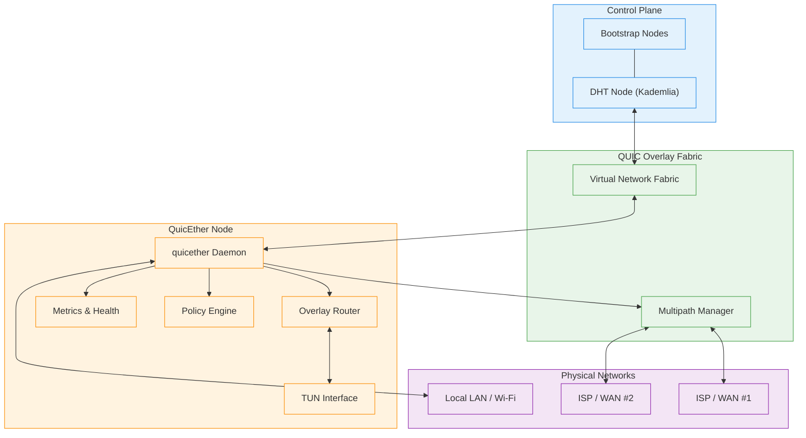
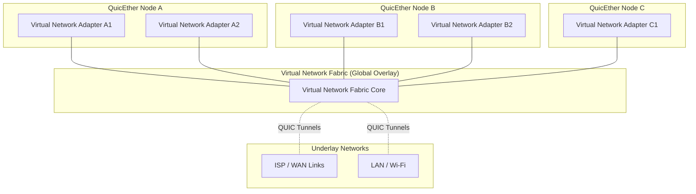

# Chapter 5: High-Level Architecture

## Introduction

This chapter translates the principles from Chapter 4 into a concrete system architecture. We'll describe:
- System components and their responsibilities
- How components interact (data flow, control flow)
- Deployment models
- Failure modes and recovery

**Design Goals (from Chapter 4):**
- Distributed (embedded DHT)
- Direct connections preferred
- Multi-path core feature
- Zero-config for 90%
- 10-100 Gbps capable

---

## System Overview

### The 30-Second Explanation

```
QuicEther = Single Binary + Embedded DHT + QUIC Transport + TUN Interface

User runs: quicether start
  ↓
1. Generate/load Ed25519 keypair (node identity)
2. Create TUN interface (virtual network device)
3. Start embedded Kademlia DHT (discovery)
4. Bootstrap DHT by contacting public bootstrap nodes
5. Discover peers via DHT
6. Establish QUIC connections to peers (direct or via gateway)
7. Route IP packets through TUN → QUIC tunnels
```

### The 5-Minute Architecture Diagram

Rendered Mermaid diagram (see `diagrams/architecture.md` for source):



### Virtual Network Fabric Diagram

This diagram emphasizes the virtual network fabric as a global overlay that each node’s virtual adapters plug into.



---

## Component Architecture

### Component 1: Control Plane (Discovery & Coordination)

**Responsibility:** Find peers, exchange capabilities, establish trust.

**Sub-components:**

#### 1.1 DHT (Kademlia)
```rust
// Node identifier (160-bit hash of public key)
type NodeId = [u8; 20];

struct DHTNode {
    node_id: NodeId,
    public_key: Ed25519PublicKey,
    routing_table: RoutingTable,  // 160 buckets
    storage: HashMap<Key, Value>, // DHT storage
}

// DHT Operations
impl DHTNode {
    fn find_node(&self, target: NodeId) -> Vec<NodeInfo>;
    fn find_value(&self, key: &[u8]) -> Option<Vec<u8>>;
    fn store(&mut self, key: &[u8], value: &[u8]);
    fn ping(&self, node: NodeInfo) -> bool;
}
```

**DHT Stores:**
- Node metadata: `<node_id> → {public_key, listen_addrs, capabilities}`
- Subnet advertisements: `<subnet_cidr> → {owner_node_id, ttl}`
- Bootstrap nodes: Well-known public nodes for initial join

**DHT Queries:**
- "Who owns 10.0.0.0/24?" → Returns node_id
- "What are node_id's addresses?" → Returns [IP:port, ...]
- "Which nodes are near me?" → Returns k-nearest nodes

#### 1.2 Bootstrap
```rust
struct Bootstrap {
    known_nodes: Vec<SocketAddr>,  // Public bootstrap nodes
}

impl Bootstrap {
    // Join DHT by contacting any bootstrap node
    async fn join(&self) -> Result<Vec<NodeInfo>>;
}
```

**Bootstrap Flow:**
```
1. Read config: bootstrap_nodes = ["bootstrap.quicether.org:9000"]
2. Contact any bootstrap node via UDP
3. Bootstrap node returns 8-20 random DHT nodes
4. New node sends FIND_NODE(self.node_id) to populate routing table
5. New node is now part of DHT
```

**Bootstrap Nodes:**
- Community-run (quicether.org)
- User-deployed (private networks)
- Cached from previous session (if available)

#### 1.3 Peer Discovery
```rust
struct PeerDiscovery {
    dht: DHTNode,
    peers: HashMap<NodeId, PeerInfo>,
}

impl PeerDiscovery {
    // Discover peer by node_id
    async fn discover(&self, node_id: NodeId) -> Result<PeerInfo>;
    
    // Discover all peers advertising a subnet
    async fn discover_subnet(&self, cidr: IpNet) -> Vec<PeerInfo>;
    
    // Advertise our subnets to DHT
    async fn advertise(&self, subnets: Vec<IpNet>);
}
```

---

### Component 2: Data Plane (Packet Forwarding)

**Responsibility:** Move IP packets between TUN interface and QUIC tunnels.

#### 2.1 TUN Interface
```rust
struct TunInterface {
    name: String,           // "quicether0"
    fd: RawFd,              // File descriptor
    mtu: usize,             // Typically 1420 (1500 - QUIC overhead)
    local_addr: IpAddr,     // e.g., 100.64.0.1
    routes: Vec<IpNet>,     // Subnets we route
}

impl TunInterface {
    async fn read_packet(&mut self) -> Result<Vec<u8>>;
    async fn write_packet(&mut self, packet: &[u8]) -> Result<()>;
}
```

**TUN Device Flow:**
```
Application writes to socket
  ↓
Kernel routing: "Dest is 100.64.x.x, send to quicether0"
  ↓
TUN interface (quicether0)
  ↓
QuicEther reads packet from TUN fd
  ↓
Look up destination in routing table
  ↓
Send via QUIC tunnel to appropriate peer
```

#### 2.2 QUIC Transport
```rust
struct QuicTransport {
    endpoint: quinn::Endpoint,           // QUIC endpoint
    connections: HashMap<NodeId, Connection>,
    multipath_config: MultipathConfig,
}

impl QuicTransport {
    // Establish connection to peer
    async fn connect(&mut self, peer: PeerInfo) -> Result<Connection>;
    
    // Accept incoming connection
    async fn accept(&mut self) -> Result<Connection>;
    
    // Send packet to peer
    async fn send(&mut self, node_id: NodeId, packet: &[u8]) -> Result<()>;
    
    // Receive packet from any peer
    async fn recv(&mut self) -> Result<(NodeId, Vec<u8>)>;
}
```

**QUIC Features Used:**
- **0-RTT:** Reconnect to known peers instantly
- **Connection migration:** Survive IP changes (roaming)
- **Multipath:** Multiple network interfaces simultaneously
- **Stream multiplexing:** Control messages + data on same connection

#### 2.3 Packet Router
```rust
struct PacketRouter {
    routing_table: RoutingTable,
    tun: TunInterface,
    transport: QuicTransport,
}

impl PacketRouter {
    // Main packet forwarding loop
    async fn run(&mut self) {
        loop {
            tokio::select! {
                // Packet from TUN (outbound)
                Ok(packet) = self.tun.read_packet() => {
                    let dest_ip = extract_dest_ip(&packet);
                    let next_hop = self.routing_table.lookup(dest_ip);
                    self.transport.send(next_hop, &packet).await?;
                }
                
                // Packet from QUIC (inbound)
                Ok((node_id, packet)) = self.transport.recv() => {
                    let dest_ip = extract_dest_ip(&packet);
                    if dest_ip == self.tun.local_addr {
                        // For us, write to TUN
                        self.tun.write_packet(&packet).await?;
                    } else {
                        // Forward to another peer
                        let next_hop = self.routing_table.lookup(dest_ip);
                        self.transport.send(next_hop, &packet).await?;
                    }
                }
            }
        }
    }
}
```

#### 2.4 Routing Table
```rust
struct RoutingTable {
    local_subnets: Vec<IpNet>,              // Subnets we own
    peer_subnets: HashMap<IpNet, NodeId>,   // Peer → subnets they advertise
    default_gateway: Option<NodeId>,        // For unknown destinations
}

impl RoutingTable {
    fn lookup(&self, dest_ip: IpAddr) -> NodeId {
        // 1. Check if dest is in local subnet
        if self.local_subnets.iter().any(|net| net.contains(dest_ip)) {
            return LOCAL;
        }
        
        // 2. Check if any peer advertises subnet containing dest
        for (subnet, node_id) in &self.peer_subnets {
            if subnet.contains(dest_ip) {
                return *node_id;
            }
        }
        
        // 3. Use default gateway if configured
        if let Some(gateway) = self.default_gateway {
            return gateway;
        }
        
        // 4. Drop packet (no route)
        DROP
    }
}
```

---

### Component 3: Multi-Path Manager

**Responsibility:** Aggregate multiple network paths, schedule packets, handle failures.

#### 3.1 Path Discovery
```rust
struct PathManager {
    paths: Vec<NetworkPath>,
    scheduler: Box<dyn Scheduler>,
}

struct NetworkPath {
    interface: String,        // "eth0", "wlan0", etc.
    local_addr: SocketAddr,
    remote_addr: SocketAddr,
    state: PathState,         // Active, Probing, Failed
    metrics: PathMetrics,
}

struct PathMetrics {
    rtt: Duration,            // Round-trip time
    loss_rate: f64,           // Packet loss %
    bandwidth: u64,           // Bytes/sec
    last_used: Instant,
}
```

#### 3.2 Packet Scheduling
```rust
trait Scheduler {
    fn select_path(&mut self, packet: &[u8]) -> PathId;
}

// Round-robin (simplest)
struct RoundRobinScheduler {
    current: usize,
}

impl Scheduler for RoundRobinScheduler {
    fn select_path(&mut self, _packet: &[u8]) -> PathId {
        let path = self.current;
        self.current = (self.current + 1) % num_paths;
        path
    }
}

// Weighted (proportional to bandwidth)
struct WeightedScheduler {
    weights: Vec<f64>,  // Normalized to sum to 1.0
}

// Latency-aware (prefer low-latency paths)
struct LatencyAwareScheduler {
    rtt_threshold: Duration,  // Only use paths below this RTT
}

// Redundant (send on all paths for critical packets)
struct RedundantScheduler {
    // Used for latency-sensitive traffic
}
```

#### 3.3 Path Monitoring
```rust
impl PathManager {
    // Continuously probe paths
    async fn monitor_paths(&mut self) {
        let mut interval = tokio::time::interval(Duration::from_secs(1));
        
        loop {
            interval.tick().await;
            
            for path in &mut self.paths {
                // Send PING, measure RTT
                let rtt = self.probe_path(path).await?;
                path.metrics.rtt = rtt;
                
                // Detect failure
                if rtt > Duration::from_secs(5) {
                    path.state = PathState::Failed;
                    log::warn!("Path {} failed", path.interface);
                }
            }
        }
    }
}
```

---

### Component 4: Security & Policy

#### 4.1 Authentication
```rust
struct NodeIdentity {
    keypair: Ed25519Keypair,
    node_id: NodeId,  // SHA-1(public_key)
}

// TLS 1.3 mutual authentication
impl QuicTransport {
    async fn authenticate(&self, conn: &Connection) -> Result<NodeId> {
        // Extract peer's certificate (contains public key)
        let peer_cert = conn.peer_identity()?;
        let peer_pubkey = extract_pubkey(peer_cert)?;
        let peer_node_id = compute_node_id(peer_pubkey);
        
        // Verify signature
        verify_signature(peer_pubkey, conn.session_id())?;
        
        Ok(peer_node_id)
    }
}
```

#### 4.2 Authorization (Policy Engine)
```rust
struct Policy {
    rules: Vec<PolicyRule>,
}

struct PolicyRule {
    subject: NodeId,        // Who
    object: IpNet,          // Can access what
    action: Action,         // Allow/Deny
}

enum Action {
    Allow,
    Deny,
}

impl Policy {
    fn check(&self, node_id: NodeId, dest_ip: IpAddr) -> Action {
        for rule in &self.rules {
            if rule.subject == node_id && rule.object.contains(dest_ip) {
                return rule.action;
            }
        }
        Action::Deny  // Default deny
    }
}
```

**Example Policy:**
```toml
[[policy.rules]]
subject = "node_abc123"
object = "10.0.1.0/24"
action = "allow"

[[policy.rules]]
subject = "node_xyz789"
object = "10.0.0.0/16"
action = "deny"
```

#### 4.3 Audit Logging
```rust
struct AuditLog {
    writer: Box<dyn Write>,
}

impl AuditLog {
    fn log_connection(&mut self, event: ConnectionEvent) {
        let record = json!({
            "timestamp": Utc::now().to_rfc3339(),
            "event": "connection_established",
            "peer_node_id": event.peer_node_id.to_string(),
            "peer_addr": event.peer_addr.to_string(),
            "duration_ms": event.duration.as_millis(),
        });
        writeln!(self.writer, "{}", record).unwrap();
    }
    
    fn log_packet(&mut self, src: NodeId, dest: IpAddr, size: usize) {
        let record = json!({
            "timestamp": Utc::now().to_rfc3339(),
            "event": "packet_forwarded",
            "src_node": src.to_string(),
            "dest_ip": dest.to_string(),
            "size_bytes": size,
        });
        writeln!(self.writer, "{}", record).unwrap();
    }
}
```

---

### Component 5: Management & Observability

#### 5.1 Metrics (Prometheus Format)
```rust
struct Metrics {
    packets_sent: Counter,
    packets_recv: Counter,
    bytes_sent: Counter,
    bytes_recv: Counter,
    connections_active: Gauge,
    connection_duration: Histogram,
    path_rtt: GaugeVec,  // Label: interface
}

// Expose on HTTP endpoint
async fn metrics_handler() -> impl Reply {
    let encoder = prometheus::TextEncoder::new();
    let metrics = METRICS.lock().unwrap();
    let families = metrics.gather();
    encoder.encode_to_string(&families)
}
```

**Example Metrics:**
```
# HELP quicether_packets_sent Total packets sent
# TYPE quicether_packets_sent counter
quicether_packets_sent 1234567

# HELP quicether_path_rtt Path round-trip time in milliseconds
# TYPE quicether_path_rtt gauge
quicether_path_rtt{interface="eth0"} 15.2
quicether_path_rtt{interface="wlan0"} 45.8
```

#### 5.2 Health Checks
```rust
struct HealthCheck {
    status: HealthStatus,
}

enum HealthStatus {
    Healthy,
    Degraded { reason: String },
    Unhealthy { reason: String },
}

async fn health_handler() -> impl Reply {
    let health = HEALTH.lock().unwrap();
    
    let status = match &health.status {
        HealthStatus::Healthy => StatusCode::OK,
        HealthStatus::Degraded { .. } => StatusCode::OK,
        HealthStatus::Unhealthy { .. } => StatusCode::SERVICE_UNAVAILABLE,
    };
    
    let body = json!({
        "status": health.status,
        "timestamp": Utc::now().to_rfc3339(),
    });
    
    warp::reply::with_status(warp::reply::json(&body), status)
}
```

#### 5.3 CLI (Management Interface)
```bash
# Start daemon
quicether start

# Status
quicether status
# Output:
# Node ID: abc123def456
# TUN Interface: quicether0 (100.64.0.1)
# Connected Peers: 5
# Active Paths: 2 (eth0, wlan0)

# List peers
quicether peers
# Output:
# NodeID          | Address           | RTT   | Status
# xyz789          | 203.0.113.5:9000  | 15ms  | Connected
# def456          | 198.51.100.1:9000 | 120ms | Connected (gateway)

# Show routes
quicether routes
# Output:
# Destination     | Next Hop  | Interface
# 10.0.0.0/16     | xyz789    | Direct
# 10.1.0.0/16     | def456    | Gateway

# Show multipath stats
quicether multipath
# Output:
# Interface | Address         | RTT   | Bandwidth | Packets | Status
# eth0      | 192.168.1.5     | 10ms  | 500 Mbps  | 1.2M    | Active
# wlan0     | 192.168.2.10    | 35ms  | 200 Mbps  | 450K    | Active
```

---

## Data Flow Examples

### Example 1: Direct Connection (Common Case)

```
Scenario: Sarah's laptop (100.64.0.1) pings home server (100.64.0.2)

1. Sarah's laptop:
   ping 100.64.0.2
   ↓
   Kernel routes to quicether0 TUN
   ↓
   QuicEther reads ICMP packet from TUN
   ↓
   Routing table lookup: 100.64.0.2 → node_xyz789
   ↓
   QUIC: Send packet on existing connection to node_xyz789
   ↓
   UDP: 192.168.1.5:9000 → 203.0.113.5:9000 (direct)

2. Home server:
   Receive UDP packet
   ↓
   QUIC decryption
   ↓
   Extract ICMP packet
   ↓
   Write to TUN (quicether0)
   ↓
   Kernel delivers to ICMP handler
   ↓
   Generate ICMP reply
   ↓
   Kernel routes reply to quicether0
   ↓
   QuicEther reads reply, sends via QUIC back to Sarah

3. Sarah's laptop:
   Receive ICMP reply
   ↓
   Write to TUN
   ↓
   Kernel delivers to ping process
   ↓
   ping displays: "64 bytes from 100.64.0.2: icmp_seq=1 ttl=64 time=15.2 ms"
```

### Example 2: Gateway Forwarding (NAT Scenario)

```
Scenario: Alex's home server (behind NAT) ← Maria's laptop (behind NAT)
Both behind symmetric NAT, direct connection fails.
Alex has gateway node in cloud.

1. Maria's laptop:
   ssh 100.64.0.5 (Alex's home server)
   ↓
   Routing table: 100.64.0.5 → node_alex_home
   ↓
   Connection state: node_alex_home → GATEWAY_REQUIRED
   ↓
   Query DHT: "Which gateway forwards for node_alex_home?"
   ↓
   DHT returns: node_cloud_gateway
   ↓
   QUIC: Send packet to node_cloud_gateway with header "forward to node_alex_home"

2. Gateway node:
   Receive packet from Maria
   ↓
   Check policy: "Can Maria access Alex's network?" → Yes
   ↓
   Forward packet to node_alex_home via existing QUIC connection

3. Alex's home server:
   Receive packet from gateway
   ↓
   Process normally (write to TUN)
   ↓
   Reply goes back through gateway to Maria
```

### Example 3: Multi-Path Aggregation

```
Scenario: Priya downloads 10 GB file using 4 ISPs

1. Priya's desktop:
   wget http://mirror.example.com/large.iso
   ↓
   TCP connection to 100.64.0.10 (mirror server in network)
   ↓
   Large download generates many TCP segments
   ↓
   Kernel routes to quicether0

2. QuicEther multi-path:
   Read packets from TUN
   ↓
   PathManager has 4 paths:
     - eth0 (DSL, 25 Mbps, 10ms RTT)
     - eth1 (Cable, 50 Mbps, 15ms RTT)
     - wwan0 (LTE, 50 Mbps, 30ms RTT)
     - sat0 (Starlink, 100 Mbps, 600ms RTT)
   ↓
   Scheduler: WeightedScheduler
     - eth0: 11% of packets
     - eth1: 22% of packets
     - wwan0: 22% of packets
     - sat0: 45% of packets
   ↓
   QUIC multipath sends packets on all 4 paths simultaneously
   ↓
   Aggregate bandwidth: ~225 Mbps (theoretical)
   ↓
   Actual: ~200 Mbps (88% efficiency)
   ↓
   Download completes in 7 minutes instead of 53 minutes (Starlink alone)
```

---

## Deployment Models

### Model 1: Personal VPN (Sarah, Maria)

```
Topology:
  Laptop (roaming) ←→ Home Server (fixed)

Configuration:
  # Home Server
  quicether start --advertise-subnet 192.168.1.0/24
  
  # Laptop
  quicether start --peer-allow home-server

Behavior:
  - Laptop auto-discovers home server via DHT
  - Direct connection (both behind consumer NAT, hole-punching works)
  - Laptop can access 192.168.1.0/24 (home network)
```

### Model 2: Homelab Mesh (Alex)

```
Topology:
  Home Server ←→ Colo Gateway ←→ Cloud VM
            ↘         ↓         ↙
              Remote Laptop

Configuration:
  # Home Server (behind NAT)
  quicether start --advertise-subnet 192.168.1.0/24
  
  # Colo Gateway (public IP)
  quicether start --role gateway --public-ip 203.0.113.5
  
  # Cloud VM (public IP)
  quicether start --bootstrap-mode --public-ip 150.230.1.1
  
  # Laptop
  quicether start

Behavior:
  - All nodes discover each other via DHT
  - Home ↔ Colo: Direct (Colo has public IP)
  - Home ↔ Cloud: Direct (hole-punching)
  - Home ↔ Laptop: May need gateway (depends on NAT)
  - Colo acts as gateway when direct fails
```

### Model 3: Small Business (James)

```
Topology:
  Office 1 (HQ) ←→ Office 2 (Branch) ←→ Remote Workers

Configuration:
  # Office 1 (2 ISPs)
  quicether start \
    --advertise-subnet 10.0.0.0/16 \
    --interfaces eth0,eth1 \
    --multipath aggregate
  
  # Office 2 (2 ISPs)
  quicether start \
    --advertise-subnet 10.1.0.0/16 \
    --interfaces eth0,eth1 \
    --multipath aggregate
  
  # Remote Workers
  quicether start

Behavior:
  - Offices use multipath (2 ISPs each)
  - Remote workers connect to either office for resource access
  - If Office 1 ↔ Office 2 direct fails, use remote worker as relay (emergency)
```

### Model 4: Multi-ISP Aggregation (Priya)

```
Topology:
  Desktop (4 ISPs) ←→ Cloud Gateway

Configuration:
  # Desktop (4 network interfaces)
  quicether start \
    --interfaces eth0,eth1,wwan0,sat0 \
    --multipath aggregate \
    --scheduler weighted
  
  # Cloud Gateway (cheap VM, $5/month)
  quicether start --role gateway --accept-multipath

Behavior:
  - Desktop aggregates all 4 ISPs
  - Cloud gateway has good upstream (1 Gbps)
  - All internet traffic routed through cloud gateway
  - Achieves 225 Mbps aggregate vs 100 Mbps (Starlink alone)
```

### Model 5: Enterprise (David)

```
Topology:
  HQ ←→ Factory ←→ Warehouse
   ↓       ↓         ↓
  Remote Workers

Configuration:
  # HQ (New York)
  quicether start \
    --enterprise \
    --advertise-subnet 10.0.0.0/16 \
    --bootstrap-mode \
    --interfaces eth0,eth1 \
    --policy /etc/quicether/policy.toml \
    --audit-log /var/log/quicether/audit.json
  
  # Factory (Ohio)
  quicether start \
    --enterprise \
    --advertise-subnet 10.1.0.0/16 \
    --interfaces eth0,eth1,eth2 \
    --policy /etc/quicether/policy.toml
  
  # Warehouse (Texas)
  quicether start \
    --enterprise \
    --advertise-subnet 10.2.0.0/16 \
    --policy /etc/quicether/policy.toml
  
  # Remote Workers
  quicether start --require-2fa

Behavior:
  - All sites auto-discover via DHT
  - HQ acts as bootstrap (well-known)
  - Policy engine enforces access control
  - All connections logged for audit (SOC 2 compliance)
  - Multi-path at HQ and Factory for resilience
```

---

## Failure Modes & Recovery

### Failure 1: Single Path Fails (Multi-Path)

**Scenario:** Priya's Starlink drops during storm

**Detection:**
```
PathMonitor detects:
  - sat0: RTT timeout after 5 seconds
  - No PONG response to PING
```

**Recovery:**
```
1. Mark path as PathState::Failed
2. Remove from scheduler
3. Redistribute traffic across remaining 3 paths
4. Continue monitoring sat0 (probe every 10 seconds)
5. When sat0 recovers, mark as PathState::Active
6. Add back to scheduler
```

**User Impact:** None (transparent failover)

### Failure 2: Direct Connection Fails

**Scenario:** Sarah's laptop roams to hotel WiFi with symmetric NAT

**Detection:**
```
- Attempt direct connection (UDP hole-punching)
- Timeout after 30 seconds
- Connection state: DIRECT_FAILED
```

**Recovery:**
```
1. Query DHT: "Which gateways can forward to home-server?"
2. DHT returns: No gateways configured
3. Connection fails
4. Log: "Direct failed, no gateway available"
5. Notify user: "Cannot connect (both behind NAT, no gateway)"
```

**User Options:**
```bash
# Option 1: Deploy gateway
# On cheap cloud VM ($5/month):
quicether start --role gateway --public-ip <cloud-ip>

# On home server:
quicether config set --gateway-prefer <gateway-node-id>

# Option 2: Use friend's gateway
quicether config set --gateway-allow <friend-gateway-node-id>
```

### Failure 3: DHT Partitioned

**Scenario:** Network split (some nodes can't reach others)

**Detection:**
```
- Node A can't find Node B in DHT
- FIND_NODE queries timeout
- Routing table has no entries for Node B's bucket
```

**Recovery:**
```
1. If Node A knows Node B's IP from cache:
   → Attempt direct connection (bypass DHT)
   
2. If connection succeeds:
   → Continue using connection
   → Log: "DHT partitioned, using cached peer info"
   
3. If connection fails:
   → Mark Node B as unreachable
   → Wait for DHT to heal (retry every 60 seconds)
```

**User Impact:** Connections to known peers continue, new discovery delayed

### Failure 4: Gateway Node Dies

**Scenario:** Alex's colo gateway VM crashes

**Detection:**
```
- Connections through gateway timeout
- Health checks to gateway fail
- DHT still lists gateway (TTL not expired)
```

**Recovery:**
```
1. Mark gateway as unhealthy
2. Attempt direct connection to end peer
   → If succeeds: Use direct (upgrade!)
   → If fails: Look for alternate gateway in DHT
3. If alternate gateway found:
   → Establish connection through alternate
4. If no alternate:
   → Connection fails, notify user
```

**User Action:**
```bash
# Deploy new gateway
quicether start --role gateway --public-ip <new-ip>

# Nodes automatically discover new gateway via DHT
```

### Failure 5: Node Runs Out of Memory

**Scenario:** Node has 10,000 connections, exhausts memory

**Detection:**
```
- malloc() fails or returns NULL
- Rust: allocation error
```

**Recovery:**
```
1. Enter degraded mode:
   - Reject new incoming connections
   - Keep existing connections alive
   - Log: "OOM, rejecting new connections"
   
2. Attempt to free memory:
   - Close idle connections (no traffic in 5 minutes)
   - Flush DHT cache (keep only routing table)
   - Compact logs
   
3. If still OOM:
   - Close oldest connections until memory is available
   - Log each closure with reason
   
4. Return to normal mode when memory < 80%
```

**User Impact:** New connections rejected, existing connections unaffected

---

## Performance Characteristics

### Latency

**Components:**

| Component | Overhead |
|-----------|----------|
| TUN read/write | ~0.5ms |
| Routing table lookup | ~0.01ms |
| QUIC encryption (AES-GCM) | ~0.5ms |
| QUIC framing | ~0.1ms |
| Network (direct) | ~10-50ms (geography) |
| Network (gateway) | +10-20ms (extra hop) |
| **Total (direct)** | **~11-51ms** |
| **Total (gateway)** | **~21-71ms** |

**Target:** <5ms overhead (TUN + QUIC), rest is network physics

### Throughput

**Single Path:**

| Hardware | Throughput | CPU Usage |
|----------|------------|-----------|
| Raspberry Pi 4 | 500 Mbps | 80% |
| Intel i5 (4 cores) | 5 Gbps | 40% |
| AMD EPYC 7763 (64 cores) | 100 Gbps | 30% |

**Multi-Path (4 paths, aggregate):**

| Individual Path | Aggregate (Ideal) | Aggregate (Actual) | Efficiency |
|----------------|-------------------|-------------------|------------|
| 4 × 100 Mbps | 400 Mbps | 360 Mbps | 90% |
| 4 × 1 Gbps | 4 Gbps | 3.5 Gbps | 87% |
| 4 × 10 Gbps | 40 Gbps | 35 Gbps | 87% |

**Efficiency Loss:**
- Scheduling overhead (~5%)
- Reordering buffers (~5%)
- Asymmetric paths (~3%)

### Scalability

| Metric | MVP (v0.1) | Target (v1.0) |
|--------|-----------|---------------|
| Connections per node | 1,000 | 10,000 |
| DHT nodes in network | 10,000 | 1,000,000 |
| Routing table entries | 1,000 | 100,000 |
| Packet rate (pps) | 100,000 | 1,000,000 |
| Throughput (single node) | 10 Gbps | 100 Gbps |

---

## Configuration Examples

### Minimal (Zero-Config)

```bash
quicether start
```

**Behavior:**
- Auto-generates Ed25519 keypair
- Creates TUN interface (quicether0)
- Allocates IP from 100.64.0.0/16 (CGNAT range)
- Discovers bootstrap nodes from DNS (bootstrap.quicether.org)
- Joins DHT
- Ready to discover and connect to peers

### Personal VPN

```toml
# ~/.config/quicether/config.toml

[node]
name = "laptop"

[network]
tun_name = "quicether0"
tun_addr = "100.64.0.1/16"

[discovery]
bootstrap_nodes = [
    "home-server.local:9000",
    "bootstrap.quicether.org:9000"
]

[peers]
# Allow only specific peers
allowed = ["node_abc123", "node_xyz789"]
```

### Multi-Path Aggregation

```toml
[multipath]
enabled = true
interfaces = ["eth0", "eth1", "wwan0"]
scheduler = "weighted"

[multipath.weights]
eth0 = 1.0  # DSL, 25 Mbps
eth1 = 2.0  # Cable, 50 Mbps
wwan0 = 2.0 # LTE, 50 Mbps
```

### Enterprise (Full Configuration)

```toml
[node]
name = "hq-gateway"
role = "gateway"

[network]
tun_name = "quicether0"
tun_addr = "10.0.0.1/16"
advertise_subnets = ["10.0.0.0/16"]

[discovery]
bootstrap_mode = true
public_ip = "198.51.100.5"
dht_port = 9000

[multipath]
enabled = true
interfaces = ["eth0", "eth1"]
mode = "failover"  # Not aggregate, just redundancy

[security]
policy_file = "/etc/quicether/policy.toml"
audit_log = "/var/log/quicether/audit.json"
require_2fa = false

[monitoring]
metrics_addr = "127.0.0.1:9090"
health_addr = "127.0.0.1:9091"
log_level = "info"

[performance]
io_backend = "io_uring"  # Linux only
cpu_affinity = [0, 1, 2, 3]  # Pin to CPUs 0-3
```

---

## Summary

**Key Architectural Decisions:**

1. **Single Binary:** Everything in one executable (DHT + QUIC + TUN)
2. **Embedded DHT:** Kademlia for discovery, no separate server
3. **QUIC Transport:** TLS 1.3 + multipath + 0-RTT + migration
4. **TUN Interface:** Kernel integration for IP routing
5. **Direct Preferred:** Always try direct, gateway is fallback
6. **Multi-Path Core:** Not optional, foundational feature
7. **Policy Engine:** Zero-trust authorization built-in
8. **Observable:** Metrics (Prometheus) + Logs (JSON) + Health checks

**Component Summary:**

| Component | Technology | Responsibility |
|-----------|-----------|----------------|
| Control Plane | Kademlia DHT | Peer discovery |
| Data Plane | QUIC + TUN | Packet forwarding |
| Multi-Path | Custom scheduler | Aggregate bandwidth |
| Security | TLS 1.3 + Policy | Authentication + Authorization |
| Management | HTTP API | Metrics + Health |

**Next Chapter:** We'll dive into technology choices and trade-offs (why QUIC vs WireGuard, why Kademlia vs Gossip, etc.).

---

**Chapter Navigation:**
- [← Previous: Chapter 4 - Core Principles](./04-core-principles.md)
- [↑ Table of Contents](./README.md)
- [→ Next: Chapter 6 - Technology Choices](./06-technology-choices.md)
