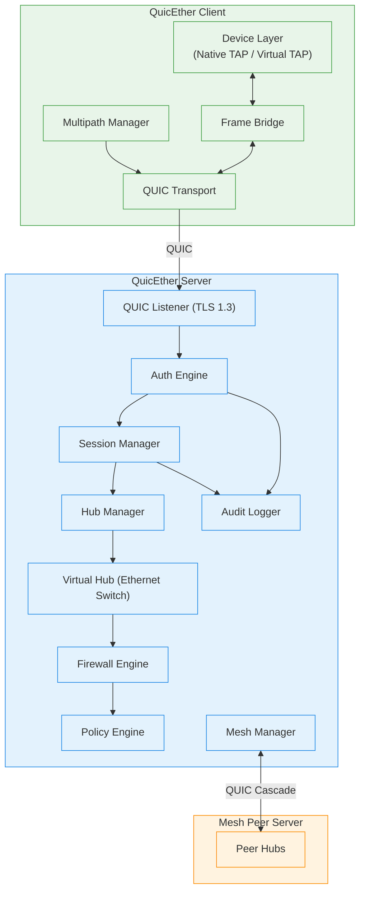
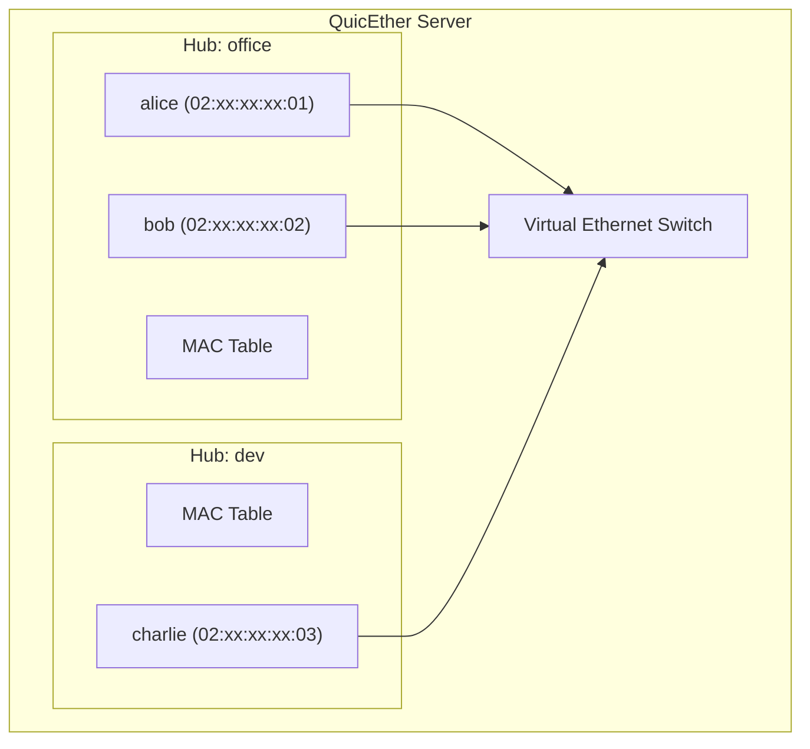

# Chapter 5: High-Level Architecture

## Introduction

This chapter translates the principles from Chapter 4 into a concrete system architecture. We'll describe:
- System components and their responsibilities
- How components interact (data flow, control flow)
- Deployment models
- Failure modes and recovery

**Design Goals (from Chapter 4, validated by httpf):**
- Server mesh for distribution (proven in httpf)
- Direct client-to-server QUIC connections
- Multi-path core feature (proven in httpf via parallel paths)
- Simple setup: one config, one command
- 10-100 Gbps capable

---

## System Overview

### The 30-Second Explanation

```
QuicEther = Single Binary + Server Mesh + QUIC Transport + TAP Interface

Server mode: quicether server --config server.toml
  ↓
1. Load/generate Ed25519 identity
2. Start QUIC listener (TLS 1.3)
3. Initialize Virtual Hubs (virtual Ethernet switches with MAC tables)
4. Accept client connections, assign MAC, create sessions
5. Connect to mesh peers (other servers) via QUIC cascade tunnels
6. Forward Ethernet frames between clients, hubs, and mesh peers

Client mode: quicether connect --server vpn.example.com
  ↓
1. Load/generate Ed25519 identity
2. Create TAP interface (or Virtual TAP on mobile/restricted platforms)
3. Authenticate to server (Ed25519 / password / service token)
4. Receive session config (hub, MAC assignment, MTU)
5. Bridge Ethernet frames through TAP → QUIC tunnel to server
```

### The 5-Minute Architecture Diagram


```mermaid
graph TD
    subgraph Server["QuicEther Server"]
        LISTENER["QUIC Listener (TLS 1.3)"]
        AUTH["Auth Engine"]
        HUB["Hub Manager"]
        SESSION["Session Manager"]
        SWITCH["Virtual Hub (Ethernet Switch)"]
        FW["Firewall Engine"]
        POLICY["Policy Engine"]
        MESH["Mesh Manager"]
        AUDIT["Audit Logger"]
    end

    subgraph Client["QuicEther Client"]
        TAP["Device Layer<br/>(Native TAP / Virtual TAP)"]
        TRANSPORT["QUIC Transport"]
        MP["Multipath Manager"]
        BRIDGE["Frame Bridge"]
    end

    subgraph MeshPeer["Mesh Peer Server"]
        PEER_HUB["Peer Hubs"]
    end

    TRANSPORT -->|QUIC| LISTENER
    LISTENER --> AUTH
    AUTH --> SESSION
    SESSION --> HUB
    HUB --> SWITCH
    SWITCH --> FW
    FW --> POLICY
    TAP <--> BRIDGE
    BRIDGE <--> TRANSPORT
    MP --> TRANSPORT
    MESH <-->|QUIC Cascade| PEER_HUB
    AUTH --> AUDIT
    SESSION --> AUDIT

    classDef server fill:#e3f2fd,stroke:#1e88e5;
    classDef client fill:#e8f5e9,stroke:#43a047;
    classDef peer fill:#fff3e0,stroke:#fb8c00;

    class Server,LISTENER,AUTH,HUB,SESSION,SWITCH,FW,POLICY,MESH,AUDIT server;
    class Client,TAP,TRANSPORT,MP,BRIDGE client;
    class MeshPeer,PEER_HUB peer;
```

### Hub-Based Multi-Tenancy Diagram

This diagram shows how hubs provide virtual Ethernet segment isolation — each hub is a broadcast domain with its own MAC table, clients, and policies (proven essential in httpf).


```mermaid
graph TD
    subgraph Server["QuicEther Server"]
        subgraph Hub1["Hub: office"]
            MAC1["MAC Table"]
            C1["alice (02:xx:xx:xx:01)"]
            C2["bob (02:xx:xx:xx:02)"]
        end
        subgraph Hub2["Hub: dev"]
            MAC2["MAC Table"]
            C3["charlie (02:xx:xx:xx:03)"]
        end
        VSWITCH["Virtual Ethernet Switch"]
    end

    C1 --> VSWITCH
    C2 --> VSWITCH
    C3 --> VSWITCH
```

---

## Component Architecture

### Component 1: Server Core (Hub & Session Management)

**Responsibility:** Accept clients, manage hubs, forward Ethernet frames, enforce policies.

**Sub-components:**

#### 1.1 Hub Manager (Virtual Ethernet Switch)
```rust
// Identity identifier (BLAKE3 hash of public key, truncated)
type IdentityId = String;  // "qe_<blake3(pk)[..16]>"

struct Hub {
    name: String,                          // "office", "dev", etc.
    mac_table: MacTable,                   // MAC address learning table
    allowed_identities: Option<Vec<IdentityId>>,  // None = open
    mtu: u16,                              // Default 1400
    firewall_rules: Vec<FirewallRule>,
    policy_rules: Vec<PolicyRule>,
    secure_nat: Option<SecureNatConfig>,   // Optional, off by default
    sessions: HashMap<IdentityId, Session>,
}

struct MacTable {
    entries: HashMap<MacAddress, MacEntry>,
    aging_time: Duration,           // Default 300s, like physical switches
}

struct MacEntry {
    identity: IdentityId,           // Which client owns this MAC
    last_seen: Instant,
}

impl Hub {
    fn learn_mac(&mut self, mac: MacAddress, identity: &IdentityId);
    fn lookup_mac(&self, mac: &MacAddress) -> Option<&MacEntry>;
    fn flush_aged(&mut self);       // Remove stale entries
    fn check_allowed(&self, identity: &IdentityId) -> bool;
}
```

#### 1.2 Session Manager
```rust
struct Session {
    identity_id: IdentityId,
    mac_address: MacAddress,       // Client's TAP MAC
    hub_name: String,
    connected_at: Instant,
    last_activity: Instant,
    bytes_sent: u64,
    bytes_recv: u64,
    auth_method: AuthMethod,      // Ed25519, Password, ServiceToken
}

struct SessionManager {
    sessions: HashMap<SessionId, Session>,
    timeout: Duration,            // Idle session timeout
}

impl SessionManager {
    async fn create_session(&mut self, identity: IdentityId, hub: &str, mac: MacAddress) -> Result<Session>;
    async fn keepalive(&mut self, session_id: &SessionId);
    async fn expire_idle(&mut self);
    fn get_session_by_mac(&self, mac: &MacAddress) -> Option<&Session>;
}
```

#### 1.3 Mesh Manager (Server-to-Server)
```rust
struct MeshManager {
    peers: Vec<MeshPeer>,
    service_token: String,        // Auth token for mesh connections
}

struct MeshPeer {
    address: SocketAddr,
    connection: Option<QuicConnection>,
    status: MeshPeerStatus,       // Connected, Reconnecting, Failed
    remote_hubs: Vec<HubInfo>,    // What hubs the peer has
    reconnect_attempts: u32,
}

impl MeshManager {
    async fn connect_to_peers(&mut self);
    async fn forward_frame(&self, dest_mac: &MacAddress, frame: &[u8]) -> Result<()>;
    async fn auto_reconnect(&mut self);  // Exponential backoff
}
```

**Mesh Flow:**
```
Server A (hub: "office", virtual Ethernet segment)
  ↕ QUIC cascade tunnel (service token auth)
Server B (hub: "dev", virtual Ethernet segment)

Client on Server A (MAC 02:aa:...) sends frame to 02:bb:... on Server B:
1. Server A MAC table: 02:bb:... not found locally
2. Flood frame to mesh peers (or use learned MAC-to-peer mapping)
3. Server B receives frame, MAC table lookup finds 02:bb:...
4. Server B delivers frame to client 02:bb:...
```

---

### Component 2: Data Plane (Ethernet Frame Forwarding)

**Responsibility:** Move Ethernet frames between TAP interface and QUIC tunnels.

#### 2.1 Device Abstraction Layer (Native TAP / Virtual TAP)

Not all platforms support TAP devices. iOS and Android only expose TUN (L3) interfaces, and some containers lack TAP. QuicEther abstracts this behind a **Device Abstraction Layer** with two modes:

```rust
/// Both modes produce/consume Ethernet frames for the QUIC tunnel.
enum DeviceMode {
    /// Real TAP device — reads/writes raw Ethernet frames.
    NativeTap(TapInterface),
    /// TUN device + userspace L2↔L3 translation.
    VirtualTap(VirtualTapInterface),
}
```

**Native TAP** (Linux, macOS, Windows): Real TAP device. Kernel produces Ethernet frames with ARP, DHCP, broadcast — full L2 transparency.

**Virtual TAP** (iOS, Android, containers): TUN device underneath. QuicEther synthesizes Ethernet headers on outbound IP packets and strips them on inbound frames. ARP is handled in userspace via an ARP proxy/cache. The server sees no difference — both modes produce Ethernet frames.

```rust
struct TapInterface {
    name: String,           // "quicether0"
    fd: RawFd,              // File descriptor
    mtu: usize,             // Typically 1420 (1500 - QUIC overhead)
    mac_addr: MacAddress,   // Locally-administered MAC (02:xx:xx:xx:xx:xx)
}

impl TapInterface {
    async fn read_frame(&mut self) -> Result<Vec<u8>>;   // Read Ethernet frame
    async fn write_frame(&mut self, frame: &[u8]) -> Result<()>;
}

struct VirtualTapInterface {
    tun: TunInterface,              // OS-level TUN device (L3 only)
    mac_address: MacAddress,        // Assigned MAC (02:xx:xx:xx:xx:xx)
    arp_cache: HashMap<Ipv4Addr, MacAddress>,  // IP → MAC for header synthesis
}

impl VirtualTapInterface {
    async fn read_frame(&mut self) -> Result<Vec<u8>>;   // TUN read + wrap in Ethernet
    async fn write_frame(&mut self, frame: &[u8]) -> Result<()>; // Strip Ethernet + TUN write
}
```

Auto-selection: Linux/macOS/Windows → Native TAP. iOS/Android → Virtual TAP. Override via `[network].device_mode` config.

See Chapter 10 for the full Virtual TAP design (L2↔L3 translation, ARP proxy, and platform matrix).

**Device Flow (Native TAP):**
```
Application writes to socket
  ↓
Kernel: ARP resolution → Ethernet frame via quicether0 TAP
  ↓
TAP interface (quicether0)
  ↓
QuicEther reads Ethernet frame from TAP fd
  ↓
Send via QUIC tunnel to server (Virtual Hub)
  ↓
Server switches frame to destination client by MAC address
```

#### 2.2 QUIC Transport
```rust
struct QuicTransport {
    endpoint: quinn::Endpoint,
    server_connection: Option<Connection>,  // Client → Server
    client_connections: HashMap<SessionId, Connection>,  // Server → Clients
    mesh_connections: HashMap<PeerId, Connection>,       // Server → Mesh Peers
}

impl QuicTransport {
    // Client: connect to server
    async fn connect_to_server(&mut self, addr: SocketAddr) -> Result<Connection>;
    
    // Server: accept incoming client
    async fn accept_client(&mut self) -> Result<Connection>;
    
    // Send frame batch (proven batching format from httpf)
    async fn send_batch(&mut self, conn: &Connection, frames: &[Vec<u8>]) -> Result<()>;
    
    // Receive frame batch
    async fn recv_batch(&mut self, conn: &Connection) -> Result<Vec<Vec<u8>>>;
}
```

**QUIC Features Used:**
- **0-RTT:** Reconnect to known servers instantly
- **Connection migration:** Survive IP changes (roaming)
- **Native multipath:** Multiple network interfaces simultaneously (QUIC-level)
- **Stream multiplexing:** Control stream + data streams on same connection
- **Integrated TLS 1.3:** No separate TLS handshake needed

#### 2.3 Virtual Hub — Ethernet Switch (Server-Side)
```rust
struct VirtualHub {
    hubs: HashMap<String, Hub>,
    mesh_peers: Vec<MeshPeer>,
    firewall: FirewallEngine,
    policy: PolicyEngine,
}

impl VirtualHub {
    // Main frame forwarding loop (server-side)
    async fn switch_frame(&self, src_session: &Session, frame: &[u8]) -> Result<()> {
        let src_mac = extract_src_mac(frame);
        let dst_mac = extract_dst_mac(frame);
        
        // 1. Verify source MAC matches session (anti-spoofing)
        if src_mac != src_session.mac_address {
            audit_log("spoofed_mac", src_session);
            return Err(Error::SpoofedSource);
        }
        
        // 2. Learn source MAC (update MAC table)
        self.learn_mac(src_mac, &src_session.identity_id);
        
        // 3. Check firewall rules (L2/L3/L4)
        if !self.firewall.check_frame(frame) {
            return Ok(()); // Silently drop
        }
        
        // 4. Check policy rules
        if !self.policy.check(&src_session.identity_id, frame) {
            return Ok(()); // Drop per policy
        }
        
        // 5. Switch frame by destination MAC
        if dst_mac.is_broadcast() || dst_mac.is_multicast() {
            // Broadcast/multicast: flood to all clients in hub + mesh peers
            self.flood_frame(src_session, frame).await?;
        } else if let Some(local_session) = self.find_session_by_mac(&dst_mac) {
            // Destination is a local client — forward directly
            local_session.send_frame(frame).await?;
        } else if let Some(mesh_peer) = self.find_mesh_peer_for_mac(&dst_mac) {
            // Destination learned on a mesh peer — forward through cascade
            mesh_peer.forward(frame).await?;
        } else {
            // Unknown MAC — flood to all ports (standard switch behavior)
            self.flood_frame(src_session, frame).await?;
        }
        
        Ok(())
    }
}
```

#### 2.4 Client Frame Bridge
```rust
struct ClientBridge {
    tap: TapInterface,
    server_conn: QuicConnection,
}

impl ClientBridge {
    async fn run(&mut self) {
        loop {
            tokio::select! {
                // Frame from TAP (outbound)
                Ok(frame) = self.tap.read_frame() => {
                    // All Ethernet frames go through tunnel to Virtual Hub
                    self.server_conn.send(&frame).await?;
                }
                
                // Frame from server (inbound)
                Ok(frame) = self.server_conn.recv() => {
                    self.tap.write_frame(&frame).await?;
                }
            }
        }
    }
}
```

---

### Component 3: Multi-Path Manager

**Responsibility:** Aggregate multiple network paths, schedule packets, handle failures.

#### 3.1 Path Discovery
```rust
struct PathManager {
    paths: Vec<NetworkPath>,
    scheduler: Box<dyn Scheduler>,
}

struct NetworkPath {
    interface: String,        // "eth0", "wlan0", etc.
    local_addr: SocketAddr,
    remote_addr: SocketAddr,
    state: PathState,         // Active, Probing, Failed
    metrics: PathMetrics,
}

struct PathMetrics {
    rtt: Duration,            // Round-trip time
    loss_rate: f64,           // Packet loss %
    bandwidth: u64,           // Bytes/sec
    last_used: Instant,
}
```

#### 3.2 Packet Scheduling
```rust
trait Scheduler {
    fn select_path(&mut self, frame: &[u8]) -> PathId;
}

// Round-robin (simplest)
struct RoundRobinScheduler {
    current: usize,
}

impl Scheduler for RoundRobinScheduler {
    fn select_path(&mut self, _frame: &[u8]) -> PathId {
        let path = self.current;
        self.current = (self.current + 1) % num_paths;
        path
    }
}

// Weighted (proportional to bandwidth)
struct WeightedScheduler {
    weights: Vec<f64>,  // Normalized to sum to 1.0
}

// Latency-aware (prefer low-latency paths)
struct LatencyAwareScheduler {
    rtt_threshold: Duration,  // Only use paths below this RTT
}

// Redundant (send on all paths for critical frames)
struct RedundantScheduler {
    // Used for latency-sensitive traffic
}
```

#### 3.3 Path Monitoring
```rust
impl PathManager {
    // Continuously probe paths
    async fn monitor_paths(&mut self) {
        let mut interval = tokio::time::interval(Duration::from_secs(1));
        
        loop {
            interval.tick().await;
            
            for path in &mut self.paths {
                // Send PING, measure RTT
                let rtt = self.probe_path(path).await?;
                path.metrics.rtt = rtt;
                
                // Detect failure
                if rtt > Duration::from_secs(5) {
                    path.state = PathState::Failed;
                    log::warn!("Path {} failed", path.interface);
                }
            }
        }
    }
}
```

---

### Component 4: Security & Policy

#### 4.1 Three-Tier Authentication (Proven in httpf)
```rust
enum AuthMethod {
    Identity(Ed25519PublicKey),    // Primary: Ed25519 keypair
    Password { hash: Argon2Hash },// Legacy: Argon2id-hashed password
    ServiceToken(String),          // M2M: For mesh, cascade, admin
}

struct Identity {
    keypair: Ed25519Keypair,
    identity_id: IdentityId,  // "qe_<blake3(public_key)[..16]>"
}

// Authentication flow
impl AuthEngine {
    async fn authenticate(&self, conn: &Connection, request: &ConnectRequest) -> Result<AuthResult> {
        match &request.auth {
            Auth::Identity { public_key, signature } => {
                // Verify Ed25519 signature over challenge
                verify_ed25519(public_key, &request.challenge, signature)?;
                let id = format!("qe_{}", blake3_hex(&public_key)[..16]);
                Ok(AuthResult::Authenticated(id))
            }
            Auth::Password { identity_id, password } => {
                // Verify Argon2id password hash
                let stored = self.password_store.get(identity_id)?;
                argon2id_verify(&stored.hash, password)?;
                Ok(AuthResult::Authenticated(identity_id.clone()))
            }
            Auth::ServiceToken { token } => {
                // Verify against configured service tokens
                if self.service_tokens.contains(token) {
                    Ok(AuthResult::Service)
                } else {
                    Err(Error::InvalidToken)
                }
            }
        }
    }
}
```

#### 4.2 Firewall Engine (Proxmox-Style ACL)
```rust
struct FirewallRule {
    action: FirewallAction,       // Accept, Drop, Reject
    direction: Direction,         // In, Out
    source_mac: Option<MacAddress>,  // L2 filtering
    source: Option<IpNet>,
    dest: Option<IpNet>,
    protocol: Option<Protocol>,   // TCP, UDP, ICMP
    dport: Option<PortRange>,
    comment: Option<String>,
}

enum FirewallAction { Accept, Drop, Reject }

struct FirewallEngine {
    rules: Vec<FirewallRule>,     // Ordered, first-match wins
    default_action: FirewallAction,
}

impl FirewallEngine {
    fn check_frame(&self, frame: &[u8]) -> bool {
        let src_mac = extract_src_mac(frame);
        let (src_ip, dst_ip) = extract_ips_from_frame(frame);
        let proto = extract_protocol_from_frame(frame);
        let dport = extract_dest_port_from_frame(frame);
        
        for rule in &self.rules {
            if rule.matches(src_mac, src_ip, dst_ip, proto, dport) {
                return matches!(rule.action, FirewallAction::Accept);
            }
        }
        matches!(self.default_action, FirewallAction::Accept)
    }
}
```

**Example Firewall Config (TOML):**
```toml
[[hub.firewall]]
action = "accept"
direction = "in"
protocol = "tcp"
dport = "22,80,443"
comment = "Allow SSH, HTTP, HTTPS"

[[hub.firewall]]
action = "accept"
direction = "in"
protocol = "icmp"
comment = "Allow ping"

[[hub.firewall]]
action = "drop"
direction = "in"
comment = "Drop everything else"
```

#### 4.3 Policy Engine (Per-Identity Access Control)
```rust
struct PolicyRule {
    identity: IdentityId,          // Who
    target: IpNet,                 // Can access what subnet
    ports: Option<Vec<PortRange>>, // On which ports
    protocol: Option<Protocol>,    // TCP/UDP/ICMP
    action: PolicyAction,          // Allow/Deny
}

struct PolicyEngine {
    rules: Vec<PolicyRule>,
}

impl PolicyEngine {
    fn check(&self, identity: &IdentityId, frame: &[u8]) -> bool {
        let dest_ip = extract_dest_ip_from_frame(frame);
        for rule in &self.rules {
            if rule.identity == *identity {
                if let Some(ip) = dest_ip {
                    if rule.target.contains(&ip) && rule.matches_port_proto_frame(frame) {
                        return matches!(rule.action, PolicyAction::Allow);
                    }
                }
            }
        }
        true  // Default allow (firewall handles L2/L3 blocking)
    }
}
```

**Example Policy:**
```toml
[[hub.policies]]
identity = "qe_abc123def456"
target = "10.0.1.0/24"
ports = [22, 80, 443]
action = "allow"

[[hub.policies]]
identity = "qe_xyz789abc012"
target = "10.0.0.0/16"
action = "deny"
```

#### 4.4 Audit Logging (Proven in httpf)
```rust
struct AuditLogger {
    file_writer: Option<BufWriter<File>>,    // JSONL file
    syslog_writer: Option<SyslogWriter>,     // RFC 5424/3164
}

impl AuditLogger {
    fn log_event(&mut self, event: AuditEvent) {
        let record = json!({
            "timestamp": Utc::now().to_rfc3339(),
            "event": event.event_type,
            "identity_id": event.identity_id,
            "hub": event.hub_name,
            "assigned_ip": event.assigned_ip,
            "remote_addr": event.remote_addr,
            "auth_method": event.auth_method,
            "reason": event.reason,
        });
        
        if let Some(ref mut writer) = self.file_writer {
            writeln!(writer, "{}", record).ok();
        }
        if let Some(ref mut syslog) = self.syslog_writer {
            syslog.send(&record);
        }
    }
}
```

**Audit Events (all proven in httpf):**
- `session_created` — client connected, MAC registered
- `session_expired` — idle timeout or disconnect
- `auth_failed` — invalid credentials
- `rate_limited` — token bucket exhausted
- `firewall_blocked` — packet dropped by ACL
- `policy_denied` — packet denied by identity policy
- `mesh_connected` — server mesh peer connected
- `cascade_forwarded` — frame forwarded via cascade
- `admin_action` — REST API admin operation

---

### Component 5: Management & Observability

#### 5.1 Metrics (Prometheus Format)
```rust
struct Metrics {
    frames_sent: Counter,
    frames_recv: Counter,
    bytes_sent: Counter,
    bytes_recv: Counter,
    connections_active: Gauge,
    connection_duration: Histogram,
    path_rtt: GaugeVec,  // Label: interface
}

// Expose on HTTP endpoint
async fn metrics_handler() -> impl Reply {
    let encoder = prometheus::TextEncoder::new();
    let metrics = METRICS.lock().unwrap();
    let families = metrics.gather();
    encoder.encode_to_string(&families)
}
```

**Example Metrics:**
```
# HELP quicether_frames_sent Total Ethernet frames sent
# TYPE quicether_frames_sent counter
quicether_frames_sent 1234567

# HELP quicether_path_rtt Path round-trip time in milliseconds
# TYPE quicether_path_rtt gauge
quicether_path_rtt{interface="eth0"} 15.2
quicether_path_rtt{interface="wlan0"} 45.8
```

#### 5.2 Health Checks
```rust
struct HealthCheck {
    status: HealthStatus,
}

enum HealthStatus {
    Healthy,
    Degraded { reason: String },
    Unhealthy { reason: String },
}

async fn health_handler() -> impl Reply {
    let health = HEALTH.lock().unwrap();
    
    let status = match &health.status {
        HealthStatus::Healthy => StatusCode::OK,
        HealthStatus::Degraded { .. } => StatusCode::OK,
        HealthStatus::Unhealthy { .. } => StatusCode::SERVICE_UNAVAILABLE,
    };
    
    let body = json!({
        "status": health.status,
        "timestamp": Utc::now().to_rfc3339(),
    });
    
    warp::reply::with_status(warp::reply::json(&body), status)
}
```

#### 5.3 CLI (Management Interface — httpf-style)
```bash
# Server mode
quicether server --config /etc/quicether/server.toml

# Client mode
quicether connect --server vpn.example.com --hub office

# Bridge mode (client + LAN bridging into Virtual Hub)
quicether bridge --server vpn.example.com --hub office --bridge-lan eth0

# Identity management
quicether identity generate
quicether identity show
# Output:
# Identity ID: qe_a1b2c3d4e5f6g7h8
# Public Key:  MCowBQYDK2VwAyEA...
# Fingerprint: SHA256:xK3d...

# Hub management (admin)
quicether hub list --server vpn.example.com
quicether hub create --name dev

# Session management
quicether session list --server vpn.example.com
# Output:
# Identity          | Hub    | MAC               | Connected | Bytes
# qe_a1b2c3d4e5f6   | office | 02:aa:bb:cc:00:01 | 2h 15m    | 1.2 GB
# qe_x9y8z7w6v5u4   | dev    | 02:aa:bb:cc:00:02 | 45m       | 340 MB

# Admin operations
quicether admin disconnect --identity qe_a1b2c3d4 --server vpn.example.com
quicether audit --server vpn.example.com --last 100
```

---

## Data Flow Examples

### Example 1: Client-to-Client via Virtual Hub (Common Case)

```
Scenario: Alice (MAC 02:aa:01) pings Bob (MAC 02:bb:02), both on hub "office"

1. Alice's laptop:
   ping 10.100.0.3 (Bob's IP, learned via ARP)
   ↓
   Kernel: ARP resolves Bob → MAC 02:bb:02
   ↓
   Ethernet frame sent to quicether0 TAP
   ↓
   QuicEther client reads Ethernet frame from TAP
   ↓
   Send via QUIC tunnel to server

2. Server (Virtual Hub / Ethernet Switch):
   Receive frame from Alice's session
   ↓
   Anti-spoof check: src_mac=02:aa:01, session MAC=02:aa:01 ✓
   ↓
   Learn source MAC: 02:aa:01 → Alice's session
   ↓
   Firewall check: ICMP allowed ✓
   ↓
   MAC lookup: 02:bb:02 → Bob's session (same hub)
   ↓
   Forward frame to Bob via QUIC

3. Bob's laptop:
   Receive frame from server
   ↓
   Write to TAP (quicether0)
   ↓
   Kernel delivers ICMP reply back through same path
   ↓
   Alice sees: "64 bytes from 10.100.0.3: time=15.2 ms"
```

### Example 2: Cross-Hub via Server Mesh

```
Scenario: Alice on Server A (hub "office") accesses Charlie on Server B (hub "dev")
Servers A and B are mesh peers with cascade connection.

1. Alice's client:
   ssh charlie.dev.local
   ↓
   ARP + Ethernet frame via TAP → QUIC tunnel → Server A

2. Server A:
   MAC table: Charlie's MAC not found locally
   ↓
   Flood frame to mesh peers via cascade tunnel → Server B

3. Server B:
   Receive from cascade tunnel
   ↓
   MAC table lookup: Charlie's MAC → Charlie's session
   ↓
   Forward frame to Charlie via QUIC

4. Reply follows reverse path: Charlie → Server B → cascade → Server A → Alice
```

### Example 3: Multi-Path Aggregation

```
Scenario: Priya downloads 10 GB file using 4 ISPs

1. Priya's desktop:
   wget http://mirror.example.com/large.iso
   ↓
   TCP connection to 100.64.0.10 (mirror server in network)
   ↓
   Large download generates many TCP segments
   ↓
   Kernel wraps in Ethernet frames → quicether0 TAP

2. QuicEther multi-path:
   Read frames from TAP
   ↓
   PathManager has 4 paths:
     - eth0 (DSL, 25 Mbps, 10ms RTT)
     - eth1 (Cable, 50 Mbps, 15ms RTT)
     - wwan0 (LTE, 50 Mbps, 30ms RTT)
     - sat0 (Starlink, 100 Mbps, 600ms RTT)
   ↓
   Scheduler: WeightedScheduler
     - eth0: 11% of frames
     - eth1: 22% of frames
     - wwan0: 22% of frames
     - sat0: 45% of frames
   ↓
   QUIC multipath sends frames on all 4 paths simultaneously
   ↓
   Aggregate bandwidth: ~225 Mbps (theoretical)
   ↓
   Actual: ~200 Mbps (88% efficiency)
   ↓
   Download completes in 7 minutes instead of 53 minutes (Starlink alone)
```

---

## Deployment Models

### Model 1: Personal VPN (Sarah, Maria)

```
Topology:
  Laptop (roaming) ←→ Server (cloud or home, $5/month VPS)

Configuration:
  # Server (cloud VPS or home server with public IP)
  quicether server --config server.toml
  # server.toml:
  # [server]
  # listen = "0.0.0.0:9443"
  # [[hubs]]
  # name = "personal"
  
  # Laptop
  quicether connect --server vpn.example.com --hub personal

Behavior:
  - Client connects to server via QUIC
  - Server adds client to Virtual Hub (Ethernet segment)
  - Client gets IP via DHCP from server's SecureNAT (or physical router)
  - All Ethernet frames tunneled through server
  - Connection survives network changes (QUIC migration)
```

### Model 2: Homelab Mesh (Alex)

```
Topology:
  Server A (home) ←mesh→ Server B (colo) ←mesh→ Server C (cloud)
                            ↑
                        Laptop connects

Configuration:
  # Home Server (behind NAT, port-forwarded or UPnP)
  quicether server --config server-home.toml
  # hubs: [{ name = "homelab" }]
  # mesh_peers: [{ address = "colo.example.com:9443", token = "..." }]
  
  # Colo Server (public IP)
  quicether server --config server-colo.toml
  # hubs: [{ name = "colo" }]
  # mesh_peers: [{ address = "home.example.com:9443", token = "..." }]
  
  # Laptop
  quicether connect --server colo.example.com --hub colo

Behavior:
  - All servers form mesh via QUIC cascade tunnels
  - Client connects to colo, can reach home via mesh
  - Automatic frame forwarding between Ethernet segments
```

### Model 3: Small Business (James)

```
Topology:
  Server (office, 2 ISPs) ←→ Remote Workers

Configuration:
  # Office Server (2 ISPs for redundancy)
  quicether server --config server.toml
  # [server]
  # listen = "0.0.0.0:9443"
  # [[hubs]]
  # name = "office"
  # allowed_identities = ["qe_alice...", "qe_bob...", "qe_charlie..."]
  
  # Remote Workers
  quicether connect --server office.example.com --hub office

Behavior:
  - Identity allowlist controls who can connect
  - Firewall rules control what clients can access
  - Audit logging for compliance
  - Workers join office Ethernet segment — office feels local
```

### Model 4: Multi-ISP Aggregation (Priya)

```
Topology:
  Desktop (4 ISPs) ←multipath→ Cloud Server

Configuration:
  # Desktop (4 network interfaces)
  quicether connect \
    --server cloud.example.com \
    --hub aggregate \
    --performance maxperformance \
    --multipath

  # Cloud Server ($5/month, 1 Gbps upstream)
  quicether server --config server.toml
  # [[hubs]]
  # name = "aggregate"

Behavior:
  - Client aggregates all 4 ISPs via QUIC multipath
  - All Ethernet frames exit through cloud server
  - Achieves ~200 Mbps aggregate vs 100 Mbps single path
```

### Model 5: Enterprise (David)

```
Topology:
  Server-HQ ←mesh→ Server-Factory ←mesh→ Server-Warehouse
       ↑                  ↑                   ↑
   HQ Workers       Factory Workers     Warehouse Workers

Configuration:
  # HQ Server (New York)
  quicether server --config server-hq.toml
  # [[hubs]]
  # name = "hq"
  # [mesh]
  # peers = [
  #   { address = "factory.example.com:9443", token = "..." },
  #   { address = "warehouse.example.com:9443", token = "..." },
  # ]
  # [audit]
  # file = "/var/log/quicether/audit.jsonl"
  # syslog = "udp://siem.example.com:514"
  
  # Factory Server (Ohio)
  quicether server --config server-factory.toml
  # Similar config with factory hub
  
  # Remote Workers
  quicether connect --server hq.example.com --hub hq

Behavior:
  - All sites form mesh, cross-site frame forwarding automatic
  - Policy engine controls per-identity access
  - All events logged for SOC 2 compliance
  - Rate limiting prevents abuse
```

---

## Failure Modes & Recovery

### Failure 1: Single Path Fails (Multi-Path)

**Scenario:** Priya's Starlink drops during storm

**Detection:**
```
PathMonitor detects:
  - sat0: RTT timeout after 5 seconds
  - No PONG response to PING
```

**Recovery:**
```
1. Mark path as PathState::Failed
2. Remove from scheduler
3. Redistribute traffic across remaining 3 paths
4. Continue monitoring sat0 (probe every 10 seconds)
5. When sat0 recovers, mark as PathState::Active
6. Add back to scheduler
```

**User Impact:** None (transparent failover)

### Failure 2: Server Connection Lost

**Scenario:** Sarah's client loses connection to server (server reboot, network issue)

**Detection:**
```
- QUIC keepalive timeout
- Connection state: DISCONNECTED
```

**Recovery:**
```
1. Client enters reconnect mode (proven in httpf)
2. Exponential backoff: 1s, 2s, 4s, 8s, ... max 60s
3. On reconnect:
   - Re-authenticate (0-RTT if session cached)
   - Request same IP from hub pool
   - Resume traffic
4. If server unreachable after max retries:
   - Log: "Server unreachable, retrying..."
   - Continue retry loop indefinitely
```

**User Impact:** Brief interruption, automatic recovery

### Failure 3: Mesh Peer Disconnected

**Scenario:** Server B in mesh goes offline (crash, network partition)

**Detection:**
```
- QUIC tunnel to Server B: keepalive timeout
- Mesh peer status: DISCONNECTED
```

**Recovery:**
```
1. Mark mesh peer as disconnected
2. Packets to Server B's hubs: drop (MAC entries expire)
3. Auto-reconnect with exponential backoff (proven in httpf)
4. When reconnected:
   - Re-authenticate with service token
   - Exchange hub info
   - Resume cross-site frame forwarding
```

**User Impact:** Cross-site traffic interrupted, same-site traffic unaffected

### Failure 4: MAC Table Full

**Scenario:** Hub has too many MAC entries (learning table exhausted)

**Detection:**
```
- MAC table entries exceed configured max (e.g., 10000)
```

**Recovery:**
```
1. Flush aged entries (older than aging_time)
2. If still full, reject new MAC learning (existing sessions continue)
3. Admin action: increase max_mac_entries or clean idle sessions
```

**User Impact:** New devices may not communicate until old entries age out

### Failure 5: Node Runs Out of Memory

**Scenario:** Node has 10,000 connections, exhausts memory

**Detection:**
```
- malloc() fails or returns NULL
- Rust: allocation error
```

**Recovery:**
```
1. Enter degraded mode:
   - Reject new incoming connections
   - Keep existing connections alive
   - Log: "OOM, rejecting new connections"
   
2. Attempt to free memory:
   - Close idle connections (no traffic in 5 minutes)
   - Flush DHT cache (keep only routing table)
   - Compact logs
   
3. If still OOM:
   - Close oldest connections until memory is available
   - Log each closure with reason
   
4. Return to normal mode when memory < 80%
```

**User Impact:** New connections rejected, existing connections unaffected

---

## Performance Characteristics

### Latency

**Components:**

| Component | Overhead |
|-----------|----------|
| TAP read/write | ~0.5ms |
| MAC table lookup | ~0.01ms |
| QUIC encryption (AES-GCM) | ~0.5ms |
| QUIC framing | ~0.1ms |
| Network (direct) | ~10-50ms (geography) |
| Network (gateway) | +10-20ms (extra hop) |
| **Total (direct)** | **~11-51ms** |
| **Total (gateway)** | **~21-71ms** |

**Target:** <5ms overhead (TAP + QUIC), rest is network physics

### Throughput

**Single Path:**

| Hardware | Throughput | CPU Usage |
|----------|------------|-----------|
| Raspberry Pi 4 | 500 Mbps | 80% |
| Intel i5 (4 cores) | 5 Gbps | 40% |
| AMD EPYC 7763 (64 cores) | 100 Gbps | 30% |

**Multi-Path (4 paths, aggregate):**

| Individual Path | Aggregate (Ideal) | Aggregate (Actual) | Efficiency |
|----------------|-------------------|-------------------|------------|
| 4 × 100 Mbps | 400 Mbps | 360 Mbps | 90% |
| 4 × 1 Gbps | 4 Gbps | 3.5 Gbps | 87% |
| 4 × 10 Gbps | 40 Gbps | 35 Gbps | 87% |

**Efficiency Loss:**
- Scheduling overhead (~5%)
- Reordering buffers (~5%)
- Asymmetric paths (~3%)

### Scalability

| Metric | MVP (v0.1) | Target (v1.0) |
|--------|-----------|---------------|
| Sessions per server | 1,000 | 10,000 |
| Hubs per server | 10 | 100 |
| Mesh peers per server | 10 | 50 |
| Packet rate (pps) | 100,000 | 1,000,000 |
| Throughput (single server) | 10 Gbps | 100 Gbps |

---

## Configuration Examples

### Minimal Client

```bash
quicether connect --server vpn.example.com
```

**Behavior:**
- Auto-generates Ed25519 identity (if none exists)
- Connects to server via QUIC (TLS 1.3)
- Authenticates with identity key
- Joins Virtual Hub, creates TAP interface
- Bridges Ethernet frames through tunnel

### Minimal Server

```toml
# /etc/quicether/server.toml

[server]
listen = "0.0.0.0:9443"

[[hubs]]
name = "default"
```

### Personal VPN Client

```toml
# ~/.config/quicether/client.toml

[client]
server = "vpn.example.com:9443"
hub = "personal"

[performance]
profile = "balanced"

[identity]
key_file = "~/.config/quicether/identity.key"
```

### Multi-Path Client

```toml
[client]
server = "vpn.example.com:9443"
hub = "aggregate"

[multipath]
enabled = true

[performance]
profile = "maxperformance"
```

### Enterprise Server (Full Configuration)

```toml
[server]
listen = "0.0.0.0:9443"

[identity]
key_file = "/etc/quicether/server.key"

[[hubs]]
name = "office"
dns = ["10.0.0.1", "8.8.8.8"]
mtu = 1400
allowed_identities = ["qe_alice...", "qe_bob..."]

[[hubs.firewall]]
action = "accept"
direction = "in"
protocol = "tcp"
dport = "22,80,443"

[[hubs.firewall]]
action = "drop"
direction = "in"

[[hubs.policies]]
identity = "qe_alice..."
target = "10.0.0.0/24"
action = "allow"

[mesh]
peers = [
    { address = "factory.example.com:9443", token = "mesh-secret-token" },
]

[rate_limit]
packets_per_second = 10000
burst = 50000

[audit]
file = "/var/log/quicether/audit.jsonl"
syslog_address = "udp://siem.example.com:514"
syslog_format = "rfc5424"

[monitoring]
metrics_addr = "127.0.0.1:9090"
health_addr = "127.0.0.1:9091"
log_level = "info"
```

---

## Summary

**Key Architectural Decisions (validated by httpf):**

1. **Single Binary:** Server/client/bridge/admin all in one executable
2. **Hub-Based Multi-Tenancy:** Virtual Ethernet switches with MAC tables, firewall + policy per hub
3. **QUIC Transport:** TLS 1.3 + native multipath + 0-RTT + migration
4. **TAP Interface:** Kernel integration for Ethernet bridging
5. **Server Mesh:** Server-to-server QUIC cascade tunnels for distributed topology
6. **Three-Tier Auth:** Ed25519 identity + Argon2id password + service tokens
7. **Virtual Hub (Ethernet Switch):** MAC learning, broadcast/flood, anti-spoofing
8. **Firewall + Policy:** Proxmox-style ACL + per-identity L2/L3/L4 rules
9. **Audit Logging:** JSONL + syslog for compliance
10. **Observable:** Metrics (Prometheus) + Health checks

**Component Summary:**

| Component | Technology | Responsibility |
|-----------|-----------|----------------|
| Server Core | Hub + Session Manager | Client management, MAC registration |
| Data Plane | QUIC + TAP | Ethernet frame forwarding |
| Mesh | QUIC cascade tunnels | Server-to-server frame forwarding |
| Multi-Path | QUIC multipath | Aggregate bandwidth |
| Security | TLS 1.3 + Firewall + Policy | Auth + ACL + access control |
| Audit | JSONL + Syslog | Event logging |
| Management | REST API + CLI | Admin operations |

**Next Chapter:** We'll dive into technology choices and trade-offs (why QUIC over WireGuard, why BLAKE3, why server mesh over DHT, etc.).

---

**Chapter Navigation:**
- [← Previous: Chapter 4 - Core Principles](./04-core-principles.md)
- [↑ Table of Contents](./README.md)
- [→ Next: Chapter 6 - Technology Choices](./06-technology-choices.md)
