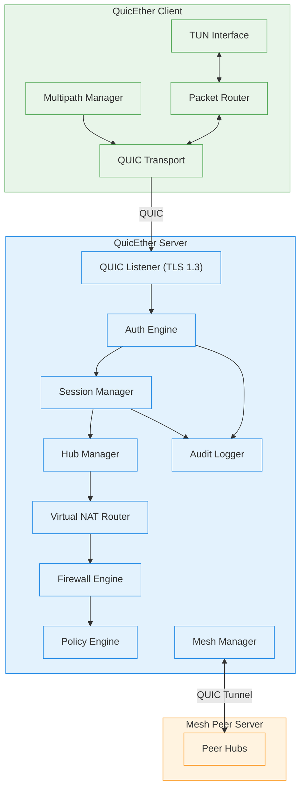
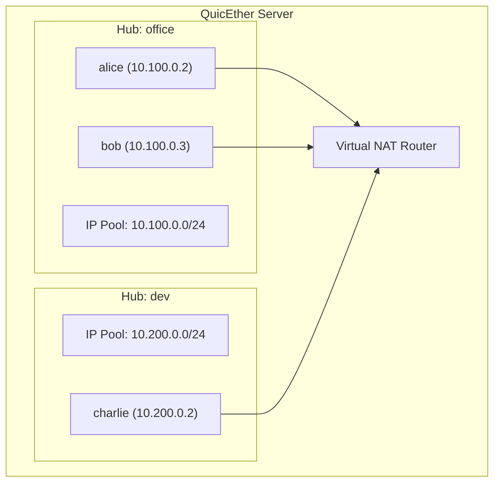

# Chapter 5: High-Level Architecture

## Introduction

This chapter translates the principles from Chapter 4 into a concrete system architecture. We'll describe:
- System components and their responsibilities
- How components interact (data flow, control flow)
- Deployment models
- Failure modes and recovery

**Design Goals (from Chapter 4, validated by httpf):**
- Server mesh for distribution (proven in httpf)
- Direct client-to-server QUIC connections
- Multi-path core feature (proven in httpf via parallel paths)
- Simple setup: one config, one command
- 10-100 Gbps capable

---

## System Overview

### The 30-Second Explanation

```
QuicEther = Single Binary + Server Mesh + QUIC Transport + TUN Interface

Server mode: quicether server --config server.toml
  ↓
1. Load/generate Ed25519 identity
2. Start QUIC listener (TLS 1.3)
3. Initialize hubs (multi-tenant namespaces with IP pools)
4. Accept client connections, assign IPs, create sessions
5. Connect to mesh peers (other servers) via QUIC tunnels
6. Route packets between clients, hubs, and mesh peers

Client mode: quicether connect --server vpn.example.com
  ↓
1. Load/generate Ed25519 identity
2. Create TUN interface (virtual network device)
3. Authenticate to server (Ed25519 / password / service token)
4. Receive session config (assigned IP, DNS, routes)
5. Route IP packets through TUN → QUIC tunnel to server
```

### The 5-Minute Architecture Diagram


```mermaid
graph TD
    subgraph Server["QuicEther Server"]
        LISTENER["QUIC Listener (TLS 1.3)"]
        AUTH["Auth Engine"]
        HUB["Hub Manager"]
        SESSION["Session Manager"]
        NAT["Virtual NAT Router"]
        FW["Firewall Engine"]
        POLICY["Policy Engine"]
        MESH["Mesh Manager"]
        AUDIT["Audit Logger"]
    end

    subgraph Client["QuicEther Client"]
        TUN["TUN Interface"]
        TRANSPORT["QUIC Transport"]
        MP["Multipath Manager"]
        ROUTER["Packet Router"]
    end

    subgraph MeshPeer["Mesh Peer Server"]
        PEER_HUB["Peer Hubs"]
    end

    TRANSPORT -->|QUIC| LISTENER
    LISTENER --> AUTH
    AUTH --> SESSION
    SESSION --> HUB
    HUB --> NAT
    NAT --> FW
    FW --> POLICY
    TUN <--> ROUTER
    ROUTER <--> TRANSPORT
    MP --> TRANSPORT
    MESH <-->|QUIC Tunnel| PEER_HUB
    AUTH --> AUDIT
    SESSION --> AUDIT

    classDef server fill:#e3f2fd,stroke:#1e88e5;
    classDef client fill:#e8f5e9,stroke:#43a047;
    classDef peer fill:#fff3e0,stroke:#fb8c00;

    class Server,LISTENER,AUTH,HUB,SESSION,NAT,FW,POLICY,MESH,AUDIT server;
    class Client,TUN,TRANSPORT,MP,ROUTER client;
    class MeshPeer,PEER_HUB peer;
```

### Hub-Based Multi-Tenancy Diagram

This diagram shows how hubs provide network namespace isolation — each hub has its own IP pool, clients, and policies (proven essential in httpf).


```mermaid
graph TD
    subgraph Server["QuicEther Server"]
        subgraph Hub1["Hub: office"]
            POOL1["IP Pool: 10.100.0.0/24"]
            C1["alice (10.100.0.2)"]
            C2["bob (10.100.0.3)"]
        end
        subgraph Hub2["Hub: dev"]
            POOL2["IP Pool: 10.200.0.0/24"]
            C3["charlie (10.200.0.2)"]
        end
        VNAT["Virtual NAT Router"]
    end

    C1 --> VNAT
    C2 --> VNAT
    C3 --> VNAT
```

---

## Component Architecture

### Component 1: Server Core (Hub & Session Management)

**Responsibility:** Accept clients, manage hubs, allocate IPs, enforce policies.

**Sub-components:**

#### 1.1 Hub Manager (Multi-Tenant Namespacing)
```rust
// Identity identifier (BLAKE3 hash of public key, truncated)
type IdentityId = String;  // "qe_<blake3(pk)[..16]>"

struct Hub {
    name: String,                          // "office", "dev", etc.
    ip_pool: IpPool,                       // CIDR pool for IP allocation
    allowed_identities: Option<Vec<IdentityId>>,  // None = open
    dns_servers: Vec<IpAddr>,
    mtu: u16,                              // Default 1400
    firewall_rules: Vec<FirewallRule>,
    policy_rules: Vec<PolicyRule>,
    nat_enabled: bool,
    sessions: HashMap<IdentityId, Session>,
}

struct IpPool {
    network: IpNet,                // e.g., 10.100.0.0/24
    gateway: IpAddr,               // e.g., 10.100.0.1 (server)
    allocated: HashMap<IpAddr, IdentityId>,
    lease_duration: Duration,
}

impl Hub {
    fn allocate_ip(&mut self, identity: &IdentityId) -> Result<IpAddr>;
    fn release_ip(&mut self, ip: IpAddr);
    fn check_allowed(&self, identity: &IdentityId) -> bool;
}
```

#### 1.2 Session Manager
```rust
struct Session {
    identity_id: IdentityId,
    assigned_ip: IpAddr,
    hub_name: String,
    connected_at: Instant,
    last_activity: Instant,
    bytes_sent: u64,
    bytes_recv: u64,
    auth_method: AuthMethod,      // Ed25519, Password, ServiceToken
}

struct SessionManager {
    sessions: HashMap<SessionId, Session>,
    timeout: Duration,            // Idle session timeout
}

impl SessionManager {
    async fn create_session(&mut self, identity: IdentityId, hub: &str) -> Result<Session>;
    async fn keepalive(&mut self, session_id: &SessionId);
    async fn expire_idle(&mut self);
    fn get_session_by_ip(&self, ip: IpAddr) -> Option<&Session>;
}
```

#### 1.3 Mesh Manager (Server-to-Server)
```rust
struct MeshManager {
    peers: Vec<MeshPeer>,
    service_token: String,        // Auth token for mesh connections
}

struct MeshPeer {
    address: SocketAddr,
    connection: Option<QuicConnection>,
    status: MeshPeerStatus,       // Connected, Reconnecting, Failed
    remote_hubs: Vec<HubInfo>,    // What hubs the peer has
    reconnect_attempts: u32,
}

impl MeshManager {
    async fn connect_to_peers(&mut self);
    async fn forward_packet(&self, dest_ip: IpAddr, packet: &[u8]) -> Result<()>;
    async fn auto_reconnect(&mut self);  // Exponential backoff
}
```

**Mesh Flow:**
```
Server A (hub: "office", 10.100.0.0/24)
  ↕ QUIC tunnel (service token auth)
Server B (hub: "dev", 10.200.0.0/24)

Client on Server A (10.100.0.2) sends packet to 10.200.0.3:
1. Server A routing table: 10.200.0.0/24 → mesh peer B
2. Forward packet through QUIC tunnel to Server B
3. Server B delivers to client 10.200.0.3
```

---

### Component 2: Data Plane (Packet Forwarding)

**Responsibility:** Move IP packets between TUN interface and QUIC tunnels.

#### 2.1 TUN Interface
```rust
struct TunInterface {
    name: String,           // "quicether0"
    fd: RawFd,              // File descriptor
    mtu: usize,             // Typically 1420 (1500 - QUIC overhead)
    local_addr: IpAddr,     // e.g., 100.64.0.1
    routes: Vec<IpNet>,     // Subnets we route
}

impl TunInterface {
    async fn read_packet(&mut self) -> Result<Vec<u8>>;
    async fn write_packet(&mut self, packet: &[u8]) -> Result<()>;
}
```

**TUN Device Flow:**
```
Application writes to socket
  ↓
Kernel routing: "Dest is 100.64.x.x, send to quicether0"
  ↓
TUN interface (quicether0)
  ↓
QuicEther reads packet from TUN fd
  ↓
Look up destination in routing table
  ↓
Send via QUIC tunnel to appropriate peer
```

#### 2.2 QUIC Transport
```rust
struct QuicTransport {
    endpoint: quinn::Endpoint,
    server_connection: Option<Connection>,  // Client → Server
    client_connections: HashMap<SessionId, Connection>,  // Server → Clients
    mesh_connections: HashMap<PeerId, Connection>,       // Server → Mesh Peers
}

impl QuicTransport {
    // Client: connect to server
    async fn connect_to_server(&mut self, addr: SocketAddr) -> Result<Connection>;
    
    // Server: accept incoming client
    async fn accept_client(&mut self) -> Result<Connection>;
    
    // Send packet batch (proven batching format from httpf)
    async fn send_batch(&mut self, conn: &Connection, packets: &[Vec<u8>]) -> Result<()>;
    
    // Receive packet batch
    async fn recv_batch(&mut self, conn: &Connection) -> Result<Vec<Vec<u8>>>;
}
```

**QUIC Features Used:**
- **0-RTT:** Reconnect to known servers instantly
- **Connection migration:** Survive IP changes (roaming)
- **Native multipath:** Multiple network interfaces simultaneously (QUIC-level)
- **Stream multiplexing:** Control stream + data streams on same connection
- **Integrated TLS 1.3:** No separate TLS handshake needed

#### 2.3 Virtual NAT Router (Server-Side)
```rust
struct VirtualNatRouter {
    hubs: HashMap<String, Hub>,
    mesh_peers: Vec<MeshPeer>,
    firewall: FirewallEngine,
    policy: PolicyEngine,
}

impl VirtualNatRouter {
    // Main packet forwarding loop (server-side)
    async fn route_packet(&self, src_session: &Session, packet: &[u8]) -> Result<()> {
        let dest_ip = extract_dest_ip(packet);
        let src_ip = extract_src_ip(packet);
        
        // 1. Verify source IP matches session (anti-spoofing)
        if src_ip != src_session.assigned_ip {
            audit_log("spoofed_source", src_session);
            return Err(Error::SpoofedSource);
        }
        
        // 2. Check firewall rules
        if !self.firewall.check(src_ip, dest_ip, packet) {
            return Ok(()); // Silently drop
        }
        
        // 3. Check policy rules
        if !self.policy.check(&src_session.identity_id, dest_ip, packet) {
            return Ok(()); // Drop per policy
        }
        
        // 4. Route to destination
        if let Some(local_session) = self.find_session_by_ip(dest_ip) {
            // Destination is a local client — forward directly
            local_session.send_packet(packet).await?;
        } else if let Some(mesh_peer) = self.find_mesh_peer_for_ip(dest_ip) {
            // Destination is on a mesh peer — forward through tunnel
            mesh_peer.forward(packet).await?;
        } else {
            // No route — drop
            return Err(Error::NoRoute);
        }
        
        Ok(())
    }
}
```

#### 2.4 Client Packet Router
```rust
struct ClientRouter {
    tun: TunInterface,
    server_conn: QuicConnection,
    routes: Vec<IpNet>,        // Routes pushed by server
    split_tunnel: bool,        // If true, only VPN routes go through tunnel
}

impl ClientRouter {
    async fn run(&mut self) {
        loop {
            tokio::select! {
                // Packet from TUN (outbound)
                Ok(packet) = self.tun.read_packet() => {
                    let dest_ip = extract_dest_ip(&packet);
                    if self.should_tunnel(dest_ip) {
                        self.server_conn.send(&packet).await?;
                    }
                    // else: goes through normal OS routing
                }
                
                // Packet from server (inbound)
                Ok(packet) = self.server_conn.recv() => {
                    self.tun.write_packet(&packet).await?;
                }
            }
        }
    }
    
    fn should_tunnel(&self, dest: IpAddr) -> bool {
        if !self.split_tunnel { return true; }
        self.routes.iter().any(|net| net.contains(&dest))
    }
}
```

---

### Component 3: Multi-Path Manager

**Responsibility:** Aggregate multiple network paths, schedule packets, handle failures.

#### 3.1 Path Discovery
```rust
struct PathManager {
    paths: Vec<NetworkPath>,
    scheduler: Box<dyn Scheduler>,
}

struct NetworkPath {
    interface: String,        // "eth0", "wlan0", etc.
    local_addr: SocketAddr,
    remote_addr: SocketAddr,
    state: PathState,         // Active, Probing, Failed
    metrics: PathMetrics,
}

struct PathMetrics {
    rtt: Duration,            // Round-trip time
    loss_rate: f64,           // Packet loss %
    bandwidth: u64,           // Bytes/sec
    last_used: Instant,
}
```

#### 3.2 Packet Scheduling
```rust
trait Scheduler {
    fn select_path(&mut self, packet: &[u8]) -> PathId;
}

// Round-robin (simplest)
struct RoundRobinScheduler {
    current: usize,
}

impl Scheduler for RoundRobinScheduler {
    fn select_path(&mut self, _packet: &[u8]) -> PathId {
        let path = self.current;
        self.current = (self.current + 1) % num_paths;
        path
    }
}

// Weighted (proportional to bandwidth)
struct WeightedScheduler {
    weights: Vec<f64>,  // Normalized to sum to 1.0
}

// Latency-aware (prefer low-latency paths)
struct LatencyAwareScheduler {
    rtt_threshold: Duration,  // Only use paths below this RTT
}

// Redundant (send on all paths for critical packets)
struct RedundantScheduler {
    // Used for latency-sensitive traffic
}
```

#### 3.3 Path Monitoring
```rust
impl PathManager {
    // Continuously probe paths
    async fn monitor_paths(&mut self) {
        let mut interval = tokio::time::interval(Duration::from_secs(1));
        
        loop {
            interval.tick().await;
            
            for path in &mut self.paths {
                // Send PING, measure RTT
                let rtt = self.probe_path(path).await?;
                path.metrics.rtt = rtt;
                
                // Detect failure
                if rtt > Duration::from_secs(5) {
                    path.state = PathState::Failed;
                    log::warn!("Path {} failed", path.interface);
                }
            }
        }
    }
}
```

---

### Component 4: Security & Policy

#### 4.1 Three-Tier Authentication (Proven in httpf)
```rust
enum AuthMethod {
    Identity(Ed25519PublicKey),    // Primary: Ed25519 keypair
    Password { hash: Argon2Hash },// Legacy: Argon2id-hashed password
    ServiceToken(String),          // M2M: For mesh, cascade, admin
}

struct Identity {
    keypair: Ed25519Keypair,
    identity_id: IdentityId,  // "qe_<blake3(public_key)[..16]>"
}

// Authentication flow
impl AuthEngine {
    async fn authenticate(&self, conn: &Connection, request: &ConnectRequest) -> Result<AuthResult> {
        match &request.auth {
            Auth::Identity { public_key, signature } => {
                // Verify Ed25519 signature over challenge
                verify_ed25519(public_key, &request.challenge, signature)?;
                let id = format!("qe_{}", blake3_hex(&public_key)[..16]);
                Ok(AuthResult::Authenticated(id))
            }
            Auth::Password { identity_id, password } => {
                // Verify Argon2id password hash
                let stored = self.password_store.get(identity_id)?;
                argon2id_verify(&stored.hash, password)?;
                Ok(AuthResult::Authenticated(identity_id.clone()))
            }
            Auth::ServiceToken { token } => {
                // Verify against configured service tokens
                if self.service_tokens.contains(token) {
                    Ok(AuthResult::Service)
                } else {
                    Err(Error::InvalidToken)
                }
            }
        }
    }
}
```

#### 4.2 Firewall Engine (Proxmox-Style ACL)
```rust
struct FirewallRule {
    action: FirewallAction,       // Accept, Drop, Reject
    direction: Direction,         // In, Out
    source: Option<IpNet>,
    dest: Option<IpNet>,
    protocol: Option<Protocol>,   // TCP, UDP, ICMP
    dport: Option<PortRange>,
    comment: Option<String>,
}

enum FirewallAction { Accept, Drop, Reject }

struct FirewallEngine {
    rules: Vec<FirewallRule>,     // Ordered, first-match wins
    default_action: FirewallAction,
}

impl FirewallEngine {
    fn check(&self, src: IpAddr, dst: IpAddr, packet: &[u8]) -> bool {
        let proto = extract_protocol(packet);
        let dport = extract_dest_port(packet);
        
        for rule in &self.rules {
            if rule.matches(src, dst, proto, dport) {
                return matches!(rule.action, FirewallAction::Accept);
            }
        }
        matches!(self.default_action, FirewallAction::Accept)
    }
}
```

**Example Firewall Config (TOML):**
```toml
[[hub.firewall]]
action = "accept"
direction = "in"
protocol = "tcp"
dport = "22,80,443"
comment = "Allow SSH, HTTP, HTTPS"

[[hub.firewall]]
action = "accept"
direction = "in"
protocol = "icmp"
comment = "Allow ping"

[[hub.firewall]]
action = "drop"
direction = "in"
comment = "Drop everything else"
```

#### 4.3 Policy Engine (Per-Identity Access Control)
```rust
struct PolicyRule {
    identity: IdentityId,          // Who
    target: IpNet,                 // Can access what subnet
    ports: Option<Vec<PortRange>>, // On which ports
    protocol: Option<Protocol>,    // TCP/UDP/ICMP
    action: PolicyAction,          // Allow/Deny
}

struct PolicyEngine {
    rules: Vec<PolicyRule>,
}

impl PolicyEngine {
    fn check(&self, identity: &IdentityId, dest_ip: IpAddr, packet: &[u8]) -> bool {
        for rule in &self.rules {
            if rule.identity == *identity && rule.target.contains(&dest_ip) {
                if rule.matches_port_proto(packet) {
                    return matches!(rule.action, PolicyAction::Allow);
                }
            }
        }
        true  // Default allow (firewall handles L3 blocking)
    }
}
```

**Example Policy:**
```toml
[[hub.policies]]
identity = "qe_abc123def456"
target = "10.0.1.0/24"
ports = [22, 80, 443]
action = "allow"

[[hub.policies]]
identity = "qe_xyz789abc012"
target = "10.0.0.0/16"
action = "deny"
```

#### 4.4 Audit Logging (Proven in httpf)
```rust
struct AuditLogger {
    file_writer: Option<BufWriter<File>>,    // JSONL file
    syslog_writer: Option<SyslogWriter>,     // RFC 5424/3164
}

impl AuditLogger {
    fn log_event(&mut self, event: AuditEvent) {
        let record = json!({
            "timestamp": Utc::now().to_rfc3339(),
            "event": event.event_type,
            "identity_id": event.identity_id,
            "hub": event.hub_name,
            "assigned_ip": event.assigned_ip,
            "remote_addr": event.remote_addr,
            "auth_method": event.auth_method,
            "reason": event.reason,
        });
        
        if let Some(ref mut writer) = self.file_writer {
            writeln!(writer, "{}", record).ok();
        }
        if let Some(ref mut syslog) = self.syslog_writer {
            syslog.send(&record);
        }
    }
}
```

**Audit Events (all proven in httpf):**
- `session_created` — client connected, IP assigned
- `session_expired` — idle timeout or disconnect
- `auth_failed` — invalid credentials
- `rate_limited` — token bucket exhausted
- `firewall_blocked` — packet dropped by ACL
- `policy_denied` — packet denied by identity policy
- `mesh_connected` — server mesh peer connected
- `cascade_forwarded` — packet forwarded via cascade
- `admin_action` — REST API admin operation

---

### Component 5: Management & Observability

#### 5.1 Metrics (Prometheus Format)
```rust
struct Metrics {
    packets_sent: Counter,
    packets_recv: Counter,
    bytes_sent: Counter,
    bytes_recv: Counter,
    connections_active: Gauge,
    connection_duration: Histogram,
    path_rtt: GaugeVec,  // Label: interface
}

// Expose on HTTP endpoint
async fn metrics_handler() -> impl Reply {
    let encoder = prometheus::TextEncoder::new();
    let metrics = METRICS.lock().unwrap();
    let families = metrics.gather();
    encoder.encode_to_string(&families)
}
```

**Example Metrics:**
```
# HELP quicether_packets_sent Total packets sent
# TYPE quicether_packets_sent counter
quicether_packets_sent 1234567

# HELP quicether_path_rtt Path round-trip time in milliseconds
# TYPE quicether_path_rtt gauge
quicether_path_rtt{interface="eth0"} 15.2
quicether_path_rtt{interface="wlan0"} 45.8
```

#### 5.2 Health Checks
```rust
struct HealthCheck {
    status: HealthStatus,
}

enum HealthStatus {
    Healthy,
    Degraded { reason: String },
    Unhealthy { reason: String },
}

async fn health_handler() -> impl Reply {
    let health = HEALTH.lock().unwrap();
    
    let status = match &health.status {
        HealthStatus::Healthy => StatusCode::OK,
        HealthStatus::Degraded { .. } => StatusCode::OK,
        HealthStatus::Unhealthy { .. } => StatusCode::SERVICE_UNAVAILABLE,
    };
    
    let body = json!({
        "status": health.status,
        "timestamp": Utc::now().to_rfc3339(),
    });
    
    warp::reply::with_status(warp::reply::json(&body), status)
}
```

#### 5.3 CLI (Management Interface — httpf-style)
```bash
# Server mode
quicether server --config /etc/quicether/server.toml

# Client mode
quicether connect --server vpn.example.com --hub office

# Bridge mode (client + subnet advertisement)
quicether bridge --server vpn.example.com --hub office --advertise 192.168.1.0/24

# Identity management
quicether identity generate
quicether identity show
# Output:
# Identity ID: qe_a1b2c3d4e5f6g7h8
# Public Key:  MCowBQYDK2VwAyEA...
# Fingerprint: SHA256:xK3d...

# Hub management (admin)
quicether hub list --server vpn.example.com
quicether hub create --name dev --cidr 10.200.0.0/24

# Session management
quicether session list --server vpn.example.com
# Output:
# Identity          | Hub    | IP          | Connected | Bytes
# qe_a1b2c3d4e5f6   | office | 10.100.0.2  | 2h 15m    | 1.2 GB
# qe_x9y8z7w6v5u4   | dev    | 10.200.0.3  | 45m       | 340 MB

# Admin operations
quicether admin disconnect --identity qe_a1b2c3d4 --server vpn.example.com
quicether audit --server vpn.example.com --last 100
```

---

## Data Flow Examples

### Example 1: Client-to-Client via Server (Common Case)

```
Scenario: Alice (10.100.0.2) pings Bob (10.100.0.3), both on hub "office"

1. Alice's laptop:
   ping 10.100.0.3
   ↓
   Kernel routes to quicether0 TUN
   ↓
   QuicEther client reads ICMP packet from TUN
   ↓
   Send via QUIC tunnel to server

2. Server (Virtual NAT Router):
   Receive packet from Alice's session
   ↓
   Anti-spoof check: src=10.100.0.2, session IP=10.100.0.2 ✓
   ↓
   Firewall check: ICMP allowed ✓
   ↓
   Policy check: Alice → 10.100.0.3 allowed ✓
   ↓
   Routing: 10.100.0.3 → Bob's session (same hub)
   ↓
   Forward packet to Bob via QUIC

3. Bob's laptop:
   Receive packet from server
   ↓
   Write to TUN (quicether0)
   ↓
   Kernel delivers ICMP reply back through same path
   ↓
   Alice sees: "64 bytes from 10.100.0.3: time=15.2 ms"
```

### Example 2: Cross-Hub via Server Mesh

```
Scenario: Alice on Server A (hub "office") accesses Charlie on Server B (hub "dev")
Servers A and B are mesh peers.

1. Alice's client:
   ssh 10.200.0.2 (Charlie on Server B)
   ↓
   QUIC tunnel → Server A

2. Server A:
   Routing table: 10.200.0.0/24 → mesh peer Server B
   ↓
   Forward packet through QUIC mesh tunnel → Server B

3. Server B:
   Receive from mesh tunnel
   ↓
   Route to Charlie's session (10.200.0.2)
   ↓
   Forward to Charlie via QUIC

4. Reply follows reverse path: Charlie → Server B → mesh → Server A → Alice
```

### Example 3: Multi-Path Aggregation

```
Scenario: Priya downloads 10 GB file using 4 ISPs

1. Priya's desktop:
   wget http://mirror.example.com/large.iso
   ↓
   TCP connection to 100.64.0.10 (mirror server in network)
   ↓
   Large download generates many TCP segments
   ↓
   Kernel routes to quicether0

2. QuicEther multi-path:
   Read packets from TUN
   ↓
   PathManager has 4 paths:
     - eth0 (DSL, 25 Mbps, 10ms RTT)
     - eth1 (Cable, 50 Mbps, 15ms RTT)
     - wwan0 (LTE, 50 Mbps, 30ms RTT)
     - sat0 (Starlink, 100 Mbps, 600ms RTT)
   ↓
   Scheduler: WeightedScheduler
     - eth0: 11% of packets
     - eth1: 22% of packets
     - wwan0: 22% of packets
     - sat0: 45% of packets
   ↓
   QUIC multipath sends packets on all 4 paths simultaneously
   ↓
   Aggregate bandwidth: ~225 Mbps (theoretical)
   ↓
   Actual: ~200 Mbps (88% efficiency)
   ↓
   Download completes in 7 minutes instead of 53 minutes (Starlink alone)
```

---

## Deployment Models

### Model 1: Personal VPN (Sarah, Maria)

```
Topology:
  Laptop (roaming) ←→ Server (cloud or home, $5/month VPS)

Configuration:
  # Server (cloud VPS or home server with public IP)
  quicether server --config server.toml
  # server.toml:
  # [server]
  # listen = "0.0.0.0:9443"
  # [[hubs]]
  # name = "personal"
  # cidr = "10.100.0.0/24"
  
  # Laptop
  quicether connect --server vpn.example.com --hub personal

Behavior:
  - Client connects to server via QUIC
  - Server assigns IP from hub pool
  - All traffic tunneled through server (or split-tunnel)
  - Connection survives network changes (QUIC migration)
```

### Model 2: Homelab Mesh (Alex)

```
Topology:
  Server A (home) ←mesh→ Server B (colo) ←mesh→ Server C (cloud)
                            ↑
                        Laptop connects

Configuration:
  # Home Server (behind NAT, port-forwarded or UPnP)
  quicether server --config server-home.toml
  # hubs: [{ name = "homelab", cidr = "10.100.0.0/24" }]
  # mesh_peers: [{ address = "colo.example.com:9443", token = "..." }]
  
  # Colo Server (public IP)
  quicether server --config server-colo.toml
  # hubs: [{ name = "colo", cidr = "10.200.0.0/24" }]
  # mesh_peers: [{ address = "home.example.com:9443", token = "..." }]
  
  # Laptop
  quicether connect --server colo.example.com --hub colo

Behavior:
  - All servers form mesh via QUIC tunnels
  - Client connects to colo, can reach home via mesh
  - Automatic mesh routing between subnets
```

### Model 3: Small Business (James)

```
Topology:
  Server (office, 2 ISPs) ←→ Remote Workers

Configuration:
  # Office Server (2 ISPs for redundancy)
  quicether server --config server.toml
  # [server]
  # listen = "0.0.0.0:9443"
  # [[hubs]]
  # name = "office"
  # cidr = "10.0.0.0/24"
  # allowed_identities = ["qe_alice...", "qe_bob...", "qe_charlie..."]
  
  # Remote Workers
  quicether connect --server office.example.com --hub office

Behavior:
  - Identity allowlist controls who can connect
  - Firewall rules control what clients can access
  - Audit logging for compliance
  - Workers see office network as local
```

### Model 4: Multi-ISP Aggregation (Priya)

```
Topology:
  Desktop (4 ISPs) ←multipath→ Cloud Server

Configuration:
  # Desktop (4 network interfaces)
  quicether connect \
    --server cloud.example.com \
    --hub aggregate \
    --performance maxperformance \
    --multipath

  # Cloud Server ($5/month, 1 Gbps upstream)
  quicether server --config server.toml
  # [[hubs]]
  # name = "aggregate"
  # cidr = "10.100.0.0/24"

Behavior:
  - Client aggregates all 4 ISPs via QUIC multipath
  - All traffic exits through cloud server
  - Achieves ~200 Mbps aggregate vs 100 Mbps single path
```

### Model 5: Enterprise (David)

```
Topology:
  Server-HQ ←mesh→ Server-Factory ←mesh→ Server-Warehouse
       ↑                  ↑                   ↑
   HQ Workers       Factory Workers     Warehouse Workers

Configuration:
  # HQ Server (New York)
  quicether server --config server-hq.toml
  # [[hubs]]
  # name = "hq"
  # cidr = "10.0.0.0/24"
  # [mesh]
  # peers = [
  #   { address = "factory.example.com:9443", token = "..." },
  #   { address = "warehouse.example.com:9443", token = "..." },
  # ]
  # [audit]
  # file = "/var/log/quicether/audit.jsonl"
  # syslog = "udp://siem.example.com:514"
  
  # Factory Server (Ohio)
  quicether server --config server-factory.toml
  # Similar config with factory hub
  
  # Remote Workers
  quicether connect --server hq.example.com --hub hq

Behavior:
  - All sites form mesh, cross-site routing automatic
  - Policy engine controls per-identity access
  - All events logged for SOC 2 compliance
  - Rate limiting prevents abuse
```

---

## Failure Modes & Recovery

### Failure 1: Single Path Fails (Multi-Path)

**Scenario:** Priya's Starlink drops during storm

**Detection:**
```
PathMonitor detects:
  - sat0: RTT timeout after 5 seconds
  - No PONG response to PING
```

**Recovery:**
```
1. Mark path as PathState::Failed
2. Remove from scheduler
3. Redistribute traffic across remaining 3 paths
4. Continue monitoring sat0 (probe every 10 seconds)
5. When sat0 recovers, mark as PathState::Active
6. Add back to scheduler
```

**User Impact:** None (transparent failover)

### Failure 2: Server Connection Lost

**Scenario:** Sarah's client loses connection to server (server reboot, network issue)

**Detection:**
```
- QUIC keepalive timeout
- Connection state: DISCONNECTED
```

**Recovery:**
```
1. Client enters reconnect mode (proven in httpf)
2. Exponential backoff: 1s, 2s, 4s, 8s, ... max 60s
3. On reconnect:
   - Re-authenticate (0-RTT if session cached)
   - Request same IP from hub pool
   - Resume traffic
4. If server unreachable after max retries:
   - Log: "Server unreachable, retrying..."
   - Continue retry loop indefinitely
```

**User Impact:** Brief interruption, automatic recovery

### Failure 3: Mesh Peer Disconnected

**Scenario:** Server B in mesh goes offline (crash, network partition)

**Detection:**
```
- QUIC tunnel to Server B: keepalive timeout
- Mesh peer status: DISCONNECTED
```

**Recovery:**
```
1. Mark mesh peer as disconnected
2. Packets to Server B's subnets: drop with ICMP unreachable
3. Auto-reconnect with exponential backoff (proven in httpf)
4. When reconnected:
   - Re-authenticate with service token
   - Exchange hub/subnet info
   - Resume cross-site routing
```

**User Impact:** Cross-site traffic interrupted, same-site traffic unaffected

### Failure 4: Hub IP Pool Exhausted

### Failure 4: Hub IP Pool Exhausted

**Scenario:** Hub "office" has 10.100.0.0/24 (254 addresses) and all are allocated

**Detection:**
```
- New client connects, hub.allocate_ip() returns Err(PoolExhausted)
```

**Recovery:**
```
1. Reject connection with clear error: "Hub 'office' IP pool exhausted"
2. Admin action: expand pool or clean expired sessions
3. Automatic: expire idle sessions (no keepalive in timeout period)
4. Alternative: configure larger CIDR (e.g., /16)
```

**User Impact:** New connections rejected, existing connections unaffected

### Failure 5: Node Runs Out of Memory

**Scenario:** Node has 10,000 connections, exhausts memory

**Detection:**
```
- malloc() fails or returns NULL
- Rust: allocation error
```

**Recovery:**
```
1. Enter degraded mode:
   - Reject new incoming connections
   - Keep existing connections alive
   - Log: "OOM, rejecting new connections"
   
2. Attempt to free memory:
   - Close idle connections (no traffic in 5 minutes)
   - Flush DHT cache (keep only routing table)
   - Compact logs
   
3. If still OOM:
   - Close oldest connections until memory is available
   - Log each closure with reason
   
4. Return to normal mode when memory < 80%
```

**User Impact:** New connections rejected, existing connections unaffected

---

## Performance Characteristics

### Latency

**Components:**

| Component | Overhead |
|-----------|----------|
| TUN read/write | ~0.5ms |
| Routing table lookup | ~0.01ms |
| QUIC encryption (AES-GCM) | ~0.5ms |
| QUIC framing | ~0.1ms |
| Network (direct) | ~10-50ms (geography) |
| Network (gateway) | +10-20ms (extra hop) |
| **Total (direct)** | **~11-51ms** |
| **Total (gateway)** | **~21-71ms** |

**Target:** <5ms overhead (TUN + QUIC), rest is network physics

### Throughput

**Single Path:**

| Hardware | Throughput | CPU Usage |
|----------|------------|-----------|
| Raspberry Pi 4 | 500 Mbps | 80% |
| Intel i5 (4 cores) | 5 Gbps | 40% |
| AMD EPYC 7763 (64 cores) | 100 Gbps | 30% |

**Multi-Path (4 paths, aggregate):**

| Individual Path | Aggregate (Ideal) | Aggregate (Actual) | Efficiency |
|----------------|-------------------|-------------------|------------|
| 4 × 100 Mbps | 400 Mbps | 360 Mbps | 90% |
| 4 × 1 Gbps | 4 Gbps | 3.5 Gbps | 87% |
| 4 × 10 Gbps | 40 Gbps | 35 Gbps | 87% |

**Efficiency Loss:**
- Scheduling overhead (~5%)
- Reordering buffers (~5%)
- Asymmetric paths (~3%)

### Scalability

| Metric | MVP (v0.1) | Target (v1.0) |
|--------|-----------|---------------|
| Sessions per server | 1,000 | 10,000 |
| Hubs per server | 10 | 100 |
| Mesh peers per server | 10 | 50 |
| Packet rate (pps) | 100,000 | 1,000,000 |
| Throughput (single server) | 10 Gbps | 100 Gbps |

---

## Configuration Examples

### Minimal Client

```bash
quicether connect --server vpn.example.com
```

**Behavior:**
- Auto-generates Ed25519 identity (if none exists)
- Connects to server via QUIC (TLS 1.3)
- Authenticates with identity key
- Receives IP assignment, creates TUN interface
- Routes traffic through tunnel

### Minimal Server

```toml
# /etc/quicether/server.toml

[server]
listen = "0.0.0.0:9443"

[[hubs]]
name = "default"
cidr = "10.100.0.0/24"
```

### Personal VPN Client

```toml
# ~/.config/quicether/client.toml

[client]
server = "vpn.example.com:9443"
hub = "personal"
split_tunnel = false    # Full tunnel

[performance]
profile = "balanced"

[identity]
key_file = "~/.config/quicether/identity.key"
```

### Multi-Path Client

```toml
[client]
server = "vpn.example.com:9443"
hub = "aggregate"

[multipath]
enabled = true

[performance]
profile = "maxperformance"
```

### Enterprise Server (Full Configuration)

```toml
[server]
listen = "0.0.0.0:9443"

[identity]
key_file = "/etc/quicether/server.key"

[[hubs]]
name = "office"
cidr = "10.0.0.0/24"
dns = ["10.0.0.1", "8.8.8.8"]
mtu = 1400
allowed_identities = ["qe_alice...", "qe_bob..."]

[[hubs.firewall]]
action = "accept"
direction = "in"
protocol = "tcp"
dport = "22,80,443"

[[hubs.firewall]]
action = "drop"
direction = "in"

[[hubs.policies]]
identity = "qe_alice..."
target = "10.0.0.0/24"
action = "allow"

[mesh]
peers = [
    { address = "factory.example.com:9443", token = "mesh-secret-token" },
]

[rate_limit]
packets_per_second = 10000
burst = 50000

[audit]
file = "/var/log/quicether/audit.jsonl"
syslog_address = "udp://siem.example.com:514"
syslog_format = "rfc5424"

[monitoring]
metrics_addr = "127.0.0.1:9090"
health_addr = "127.0.0.1:9091"
log_level = "info"
```

---

## Summary

**Key Architectural Decisions (validated by httpf):**

1. **Single Binary:** Server/client/bridge/admin all in one executable
2. **Hub-Based Multi-Tenancy:** Namespaced IP pools with firewall + policy per hub
3. **QUIC Transport:** TLS 1.3 + native multipath + 0-RTT + migration
4. **TUN Interface:** Kernel integration for IP routing
5. **Server Mesh:** Server-to-server QUIC tunnels for distributed topology
6. **Three-Tier Auth:** Ed25519 identity + Argon2id password + service tokens
7. **Virtual NAT Router:** Server-side IP allocation, anti-spoofing, forwarding
8. **Firewall + Policy:** Proxmox-style ACL + per-identity L3/L4 rules
9. **Audit Logging:** JSONL + syslog for compliance
10. **Observable:** Metrics (Prometheus) + Health checks

**Component Summary:**

| Component | Technology | Responsibility |
|-----------|-----------|----------------|
| Server Core | Hub + Session Manager | Client management, IP allocation |
| Data Plane | QUIC + TUN | Packet forwarding |
| Mesh | QUIC tunnels + routing | Server-to-server forwarding |
| Multi-Path | QUIC multipath | Aggregate bandwidth |
| Security | TLS 1.3 + Firewall + Policy | Auth + ACL + access control |
| Audit | JSONL + Syslog | Event logging |
| Management | REST API + CLI | Admin operations |

**Next Chapter:** We'll dive into technology choices and trade-offs (why QUIC over WireGuard, why BLAKE3, why server mesh over DHT, etc.).

---

**Chapter Navigation:**
- [← Previous: Chapter 4 - Core Principles](./04-core-principles.md)
- [↑ Table of Contents](./README.md)
- [→ Next: Chapter 6 - Technology Choices](./06-technology-choices.md)
