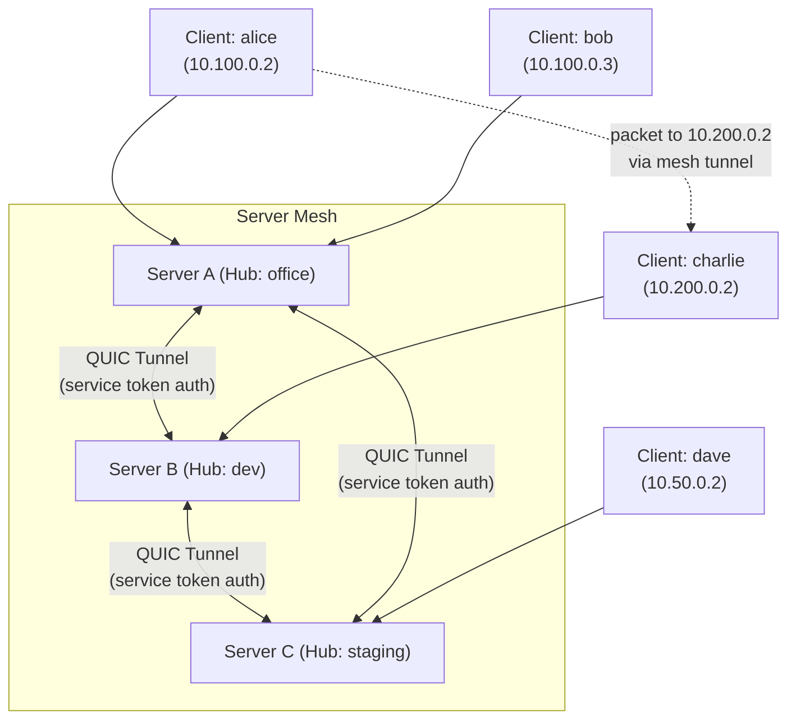

# Chapter 7: Server Mesh & Discovery



## Introduction

This chapter describes QuicEther's **server mesh** — the mechanism by which multiple QuicEther servers discover each other, exchange routing information, and forward packets between their respective client pools.

The server mesh replaces the Kademlia DHT that was originally envisioned in v1.0 of this book. After building HTTP Fabric (httpf), we learned that:

1. **Explicit server mesh is simpler and more reliable** than DHT-based discovery
2. **95% of real deployments** are served by client-server + mesh topology
3. **DHT adds complexity** without proportional benefit for initial versions
4. **Server mesh is trivially debuggable** — you can see exactly which peers are connected

DHT-based P2P discovery remains a future extension (see Chapter 16).

---

## 7.1 Mesh Architecture

### Overview

A QuicEther server mesh is a set of servers connected by persistent QUIC tunnels:

```
Server A (office hub: 10.100.0.0/24)
    ↕ QUIC tunnel (service token auth, auto-reconnect)
Server B (dev hub: 10.200.0.0/24)
    ↕ QUIC tunnel (service token auth, auto-reconnect)
Server C (staging hub: 10.50.0.0/24)
```

Each server:
- Manages its own hubs, clients, and sessions
- Connects to configured mesh peers
- Forwards packets destined for peer subnets through mesh tunnels
- Automatically reconnects to peers on failure

### Mesh vs. Hub

| Concept | Scope | Purpose |
|---------|-------|---------|
| **Hub** | Single server | Namespace for clients (IP pool, firewall, policy) |
| **Mesh** | Multiple servers | Inter-server routing and packet forwarding |

A server can have multiple hubs. The mesh connects servers so that clients in one server's hub can reach clients in another server's hub.

---

## 7.2 Mesh Configuration

### Server Config (TOML)

```toml
[server]
listen = "0.0.0.0:9443"

# Service token for authenticating mesh peers and cascade hops
service_token = "mesh-secret-token-abc123"

# Mesh peer configuration
[[mesh.peers]]
address = "server-b.example.com:9443"
token = "mesh-secret-token-xyz789"

[[mesh.peers]]
address = "server-c.example.com:9443"
token = "mesh-secret-token-def456"

# Local hubs
[[hubs]]
name = "office"
cidr = "10.100.0.0/24"
```

### Configuration Fields

| Field | Type | Required | Description |
|-------|------|----------|-------------|
| `mesh.peers[].address` | `String` | Yes | `host:port` of the mesh peer |
| `mesh.peers[].token` | `String` | Yes | Service token to authenticate to this peer |
| `service_token` | `String` | For mesh | Token that peers use to authenticate to us |

---

## 7.3 Mesh Connection Protocol

### Connection Establishment

```
Server A → Server B:
1. Open QUIC connection to Server B (TLS 1.3)
2. Send MeshConnect frame on control stream:
   {
     type: "mesh_connect",
     token: "mesh-secret-token-xyz789",
     server_id: "qe_server_a_id",
     hubs: [
       { name: "office", cidr: "10.100.0.0/24" },
     ]
   }
3. Server B validates token against its service_token
4. Server B responds with MeshAccept:
   {
     type: "mesh_accept",
     server_id: "qe_server_b_id",
     hubs: [
       { name: "dev", cidr: "10.200.0.0/24" },
     ]
   }
5. Both servers update routing tables:
   - Server A: 10.200.0.0/24 → mesh_peer_b
   - Server B: 10.100.0.0/24 → mesh_peer_a
6. Mesh tunnel is ACTIVE
```

### Wire Format (QUIC Streams)

Mesh connections use multiplexed QUIC streams:

| Stream | Purpose | Direction |
|--------|---------|-----------|
| Control stream (bi-directional) | Mesh handshake, keepalive, hub updates | Both |
| Data streams (uni-directional) | Packet forwarding | Both |

#### Control Stream Messages

```rust
enum MeshControlMessage {
    // Initial handshake
    MeshConnect {
        token: String,
        server_id: String,
        hubs: Vec<HubInfo>,
    },
    MeshAccept {
        server_id: String,
        hubs: Vec<HubInfo>,
    },
    MeshReject {
        reason: String,
    },

    // Ongoing
    Keepalive,
    HubUpdate {
        hubs: Vec<HubInfo>,
    },
}

struct HubInfo {
    name: String,
    cidr: IpNet,
    client_count: u32,
}
```

#### Data Stream Packet Format

Packets forwarded through mesh tunnels use the same PacketBatch format as client data:

```
PacketBatch (mesh forwarding):
┌──────────────────┐
│ num_packets: u16  │
├──────────────────┤
│ packet_1_size: u16│
│ packet_1_data     │  ← Raw IP packet
├──────────────────┤
│ packet_2_size: u16│
│ packet_2_data     │
├──────────────────┤
│ ...               │
└──────────────────┘
```

Packets are optionally compressed with LZ4 and encrypted with ChaCha20-Poly1305 (on top of QUIC's TLS encryption).

---

## 7.4 Mesh Routing

### Route Table Construction

Each server builds its routing table from two sources:

1. **Local hubs**: Subnets served by this server's own hubs
2. **Mesh peers**: Subnets advertised by connected mesh peers

```rust
struct MeshRoutingTable {
    local_subnets: HashMap<IpNet, String>,
    mesh_subnets: HashMap<IpNet, MeshPeerId>,
}

impl MeshRoutingTable {
    fn route(&self, dest_ip: IpAddr) -> RouteDecision {
        // 1. Check local hubs
        for (subnet, hub_name) in &self.local_subnets {
            if subnet.contains(&dest_ip) {
                return RouteDecision::Local(hub_name.clone());
            }
        }

        // 2. Check mesh peers (longest prefix match)
        let mut best_match: Option<(u8, MeshPeerId)> = None;
        for (subnet, peer_id) in &self.mesh_subnets {
            if subnet.contains(&dest_ip) {
                let prefix_len = subnet.prefix_len();
                if best_match.map_or(true, |(best, _)| prefix_len > best) {
                    best_match = Some((prefix_len, peer_id.clone()));
                }
            }
        }

        if let Some((_, peer_id)) = best_match {
            return RouteDecision::MeshForward(peer_id);
        }

        RouteDecision::Drop
    }
}
```

### Route Propagation

When a mesh peer's hubs change (new hub added, hub removed, CIDR changed), the peer sends a `HubUpdate` message on the control stream:

```
Server B adds new hub "qa" (10.50.0.0/24):
1. Server B sends HubUpdate to all mesh peers
2. Server A receives HubUpdate, updates routing table:
   - 10.200.0.0/24 → mesh_peer_b (existing)
   - 10.50.0.0/24  → mesh_peer_b (new)
3. Clients on Server A can now reach 10.50.0.0/24
```

### Multi-Hop Routing

In a mesh with 3+ servers, packets may need to traverse multiple hops:

```
Server A (10.100.0.0/24) ←→ Server B (10.200.0.0/24) ←→ Server C (10.50.0.0/24)

If Server A has no direct mesh tunnel to Server C:
- Server A knows: 10.50.0.0/24 → mesh_peer_b (learned via HubUpdate relay)
- Packet from A's client to 10.50.0.2:
  1. A forwards to B via mesh tunnel
  2. B's routing table: 10.50.0.0/24 → mesh_peer_c
  3. B forwards to C via mesh tunnel
  4. C delivers to local client

TTL limit: max 4 hops (configurable) to prevent routing loops
```

---

## 7.5 Cascade Routing

Cascade routing (proven in httpf) is a specialized form of multi-hop where servers form explicit chains for geographic or privacy routing:

```
Client → Server A (US) → Server B (EU) → Server C (Asia) → Destination
```

### Cascade vs. Mesh

| Feature | Mesh | Cascade |
|---------|------|---------|
| Purpose | Connect server sites | Geographic/privacy routing |
| Topology | Any (star, ring, full) | Linear chain |
| Auth | Service tokens | Service tokens |
| Use case | Multi-site enterprise | Privacy, geo-routing |

### Cascade Configuration

```toml
# Server A (entry point)
[cascade]
next_hop = "server-b.example.com:9443"
next_hop_token = "cascade-token-b"

# Server B (middle hop)
[cascade]
next_hop = "server-c.example.com:9443"
next_hop_token = "cascade-token-c"

# Server C (exit point)
# No cascade config — traffic exits here
```

---

## 7.6 Mesh Security

### Authentication

All mesh connections use **service tokens** (proven in httpf):

```
Server A → Server B:
  MeshConnect { token: "mesh-secret-token-xyz789", ... }

Server B validates:
  if request.token != self.config.service_token {
      return MeshReject { reason: "invalid token" };
  }
```

Service tokens are:
- Pre-shared secrets configured in TOML
- Unique per mesh peer relationship (recommended)
- Can be rotated without disconnecting clients

### Anti-Spoofing

Mesh tunnels enforce packet source validation:

```
Server A receives packet from Client X (session IP: 10.100.0.2):
1. Verify source IP matches session: src=10.100.0.2 ✓
2. Forward to mesh (if destination is on another server)

Server B receives mesh packet from Server A:
1. Trust Server A's anti-spoofing (mesh peers are trusted after auth)
2. Route to local client
```

### Rate Limiting

Mesh tunnels have configurable rate limits:

```toml
[mesh]
max_packets_per_second = 100000
burst = 500000
```

---

## 7.7 Failure Handling

### Peer Disconnection

```
Detection: QUIC connection keepalive timeout
  ↓
Mark peer as DISCONNECTED
  ↓
Auto-reconnect with exponential backoff:
  Attempt 1: wait 1s
  Attempt 2: wait 2s
  Attempt 3: wait 4s
  ...
  Max wait: 60s
  ↓
On reconnect:
  Re-authenticate with service token
  Exchange hub/subnet info (may have changed)
  Resume forwarding
  ↓
If peer unreachable for extended period:
  Remove peer routes from table
  Packets to peer subnets → drop with ICMP unreachable
  Continue retry loop indefinitely
```

### Split-Brain

If mesh connectivity is partially lost:

```
Before: A ↔ B ↔ C (all connected)
After:  A ↔ B    C (A-C tunnel down)

Result:
  - A can still reach C via B (multi-hop)
  - Routing automatically adapts
  - When A-C reconnects, direct route restored
```

---

## 7.8 Monitoring & Observability

### Mesh Health Metrics

```
# HELP quicether_mesh_peers_total Number of configured mesh peers
# TYPE quicether_mesh_peers_total gauge
quicether_mesh_peers_total 3

# HELP quicether_mesh_peers_connected Number of connected mesh peers
# TYPE quicether_mesh_peers_connected gauge
quicether_mesh_peers_connected 2

# HELP quicether_mesh_packets_forwarded Packets forwarded through mesh
# TYPE quicether_mesh_packets_forwarded counter
quicether_mesh_packets_forwarded{peer="server-b"} 1234567
```

### CLI Commands

```bash
# List mesh peers and status
quicether admin mesh status --server vpn.example.com
# Output:
# Peer                          | Status    | Hubs  | Uptime | Packets
# server-b.example.com:9443    | Connected | dev   | 2d 4h  | 1.2M
# server-c.example.com:9443    | Reconnect | qa    | -      | 0
```

---

## 7.9 Future: DHT Extension

In a future version (v2.0+), QuicEther may add optional DHT-based peer discovery:

- **Use case:** Large-scale P2P networks where explicit server configuration is impractical
- **Approach:** Kademlia-style DHT running alongside server mesh
- **Compatibility:** DHT discovery would supplement (not replace) server mesh
- **Identity:** Same Ed25519 + BLAKE3 identity system

This is documented further in Chapter 16 (Future Directions).

---

## Summary

In this chapter we:

- Defined the server mesh architecture (replacing the original DHT design)
- Specified mesh connection protocol (QUIC tunnels + service token auth)
- Designed route table construction and propagation
- Described cascade routing for geographic/privacy chains
- Addressed security, failure handling, and monitoring
- Noted DHT as a future extension

The server mesh is the **connectivity backbone** enabling:
- Multi-site deployments (enterprise, homelab)
- Cross-subnet routing between servers
- Cascade routing for privacy/geo chains
- Automatic failover and reconnection

All of these patterns were validated in HTTP Fabric (httpf) and are being ported to native QUIC.

**Next Chapter:** We will dive into the QUIC transport and multipath implementation details.

---

**Chapter Navigation:**
- [← Previous: Chapter 6 - Technology Choices](./06-technology-choices.md)
- [↑ Table of Contents](./README.md)
- [→ Next: Chapter 8 - QUIC Transport & Multipath](./08-quic-and-multipath.md)