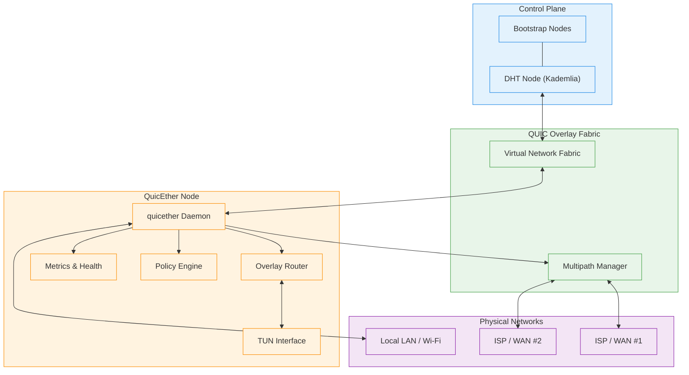
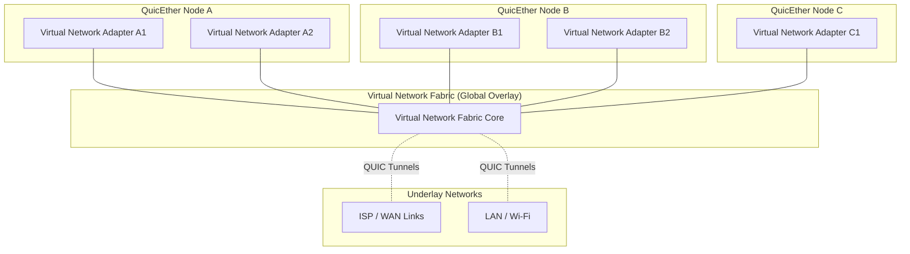
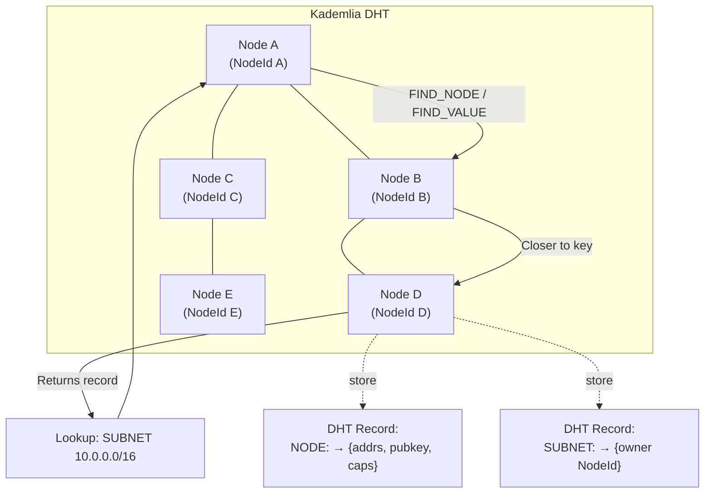

```mermaid
graph TD
    %% Top layer: Control plane
    subgraph ControlPlane[Control Plane]
        DHT["DHT Node (Kademlia)"]
        BOOT["Bootstrap Nodes"]
    end

    %% Middle layer: Overlay fabric
    subgraph OverlayFabric["QUIC Overlay Fabric"]
        VNF["Virtual Network Fabric"]
        MP["Multipath Manager"]
    end

    %% Bottom layer: Data plane per node
    subgraph Node["QuicEther Node"]
        DAEMON["quicether Daemon"]
        TUN["TUN Interface"]
        ROUTER["Overlay Router"]
        POLICY["Policy Engine"]
        METRICS["Metrics & Health"]
    end

    %% External networks
    subgraph Underlay["Physical Networks"]
        ISP1["ISP / WAN #1"]
        ISP2["ISP / WAN #2"]
        LAN["Local LAN / Wi-Fi"]
    end

    %% Relationships
    BOOT --- DHT
    DHT <--> VNF

    VNF <--> DAEMON
    DAEMON --> MP
    DAEMON --> ROUTER
    ROUTER <--> TUN
    DAEMON --> POLICY
    DAEMON --> METRICS

    MP <--> ISP1
    MP <--> ISP2
    DAEMON <--> LAN

    %% Notes
    classDef control fill:#e3f2fd,stroke:#1e88e5;
    classDef overlay fill:#e8f5e9,stroke:#43a047;
    classDef node fill:#fff3e0,stroke:#fb8c00;
    classDef underlay fill:#f3e5f5,stroke:#8e24aa;

    class ControlPlane,DHT,BOOT control;
    class OverlayFabric,VNF,MP overlay;
    class Node,DAEMON,TUN,ROUTER,POLICY,METRICS node;
    class Underlay,ISP1,ISP2,LAN underlay;
```

```mermaid
graph TD
    %% Virtual Network Fabric focus

    subgraph Fabric["Virtual Network Fabric (Global Overlay)"]
        FABRIC["Virtual Network Fabric Core"]
    end

    subgraph NodeA["QuicEther Node A"]
        VNA1["Virtual Network Adapter A1"]
        VNA2["Virtual Network Adapter A2"]
    end

    subgraph NodeB["QuicEther Node B"]
        VNB1["Virtual Network Adapter B1"]
        VNB2["Virtual Network Adapter B2"]
    end

    subgraph NodeC["QuicEther Node C"]
        VNC1["Virtual Network Adapter C1"]
    end

    %% Connections into the fabric
    VNA1 --- FABRIC
    VNA2 --- FABRIC
    VNB1 --- FABRIC
    VNB2 --- FABRIC
    VNC1 --- FABRIC

    %% Optional underlay links
    subgraph UnderlayNet["Underlay Networks"]
        U1["ISP / WAN Links"]
        U2["LAN / Wi-Fi"]
    end

    FABRIC -. "QUIC Tunnels" .- U1
    FABRIC -. "QUIC Tunnels" .- U2
```

```mermaid
graph TD
    %% DHT nodes forming the overlay
    subgraph DHTCluster["Kademlia DHT"]
        A["Node A\n(NodeId A)"]
        B["Node B\n(NodeId B)"]
        C["Node C\n(NodeId C)"]
        D["Node D\n(NodeId D)"]
        E["Node E\n(NodeId E)"]
    end

    %% Bucket relationships (logical)
    A --- B
    A --- C
    B --- D
    C --- E

    %% Lookup flow
    CLIENT["Lookup: SUBNET 10.0.0.0/16"] --> A
    A -->|FIND_NODE / FIND_VALUE| B
    B -->|Closer to key| D
    D -->|Returns record| CLIENT

    %% Record types
    RECORD_NODE["DHT Record:\nNODE:<NodeId> → {addrs, pubkey, caps}"]
    RECORD_SUBNET["DHT Record:\nSUBNET:<CIDR> → {owner NodeId}"]

    D -. store .-> RECORD_NODE
    D -. store .-> RECORD_SUBNET
```