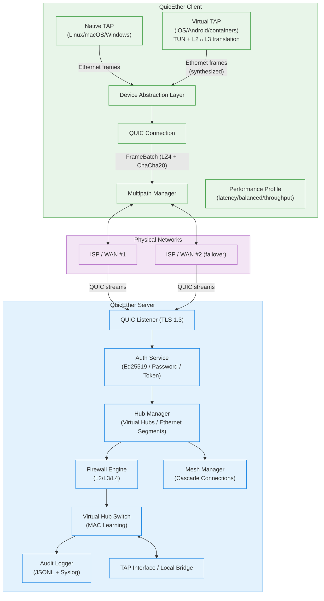
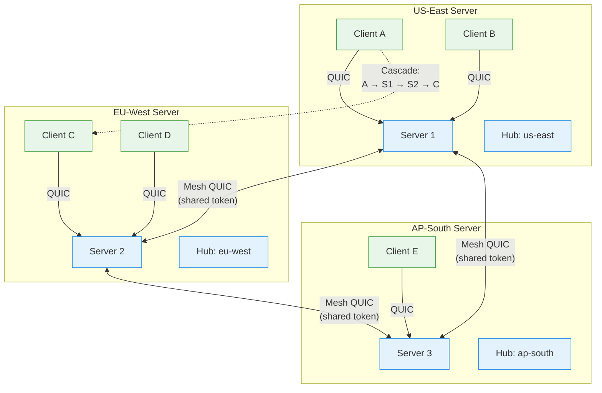
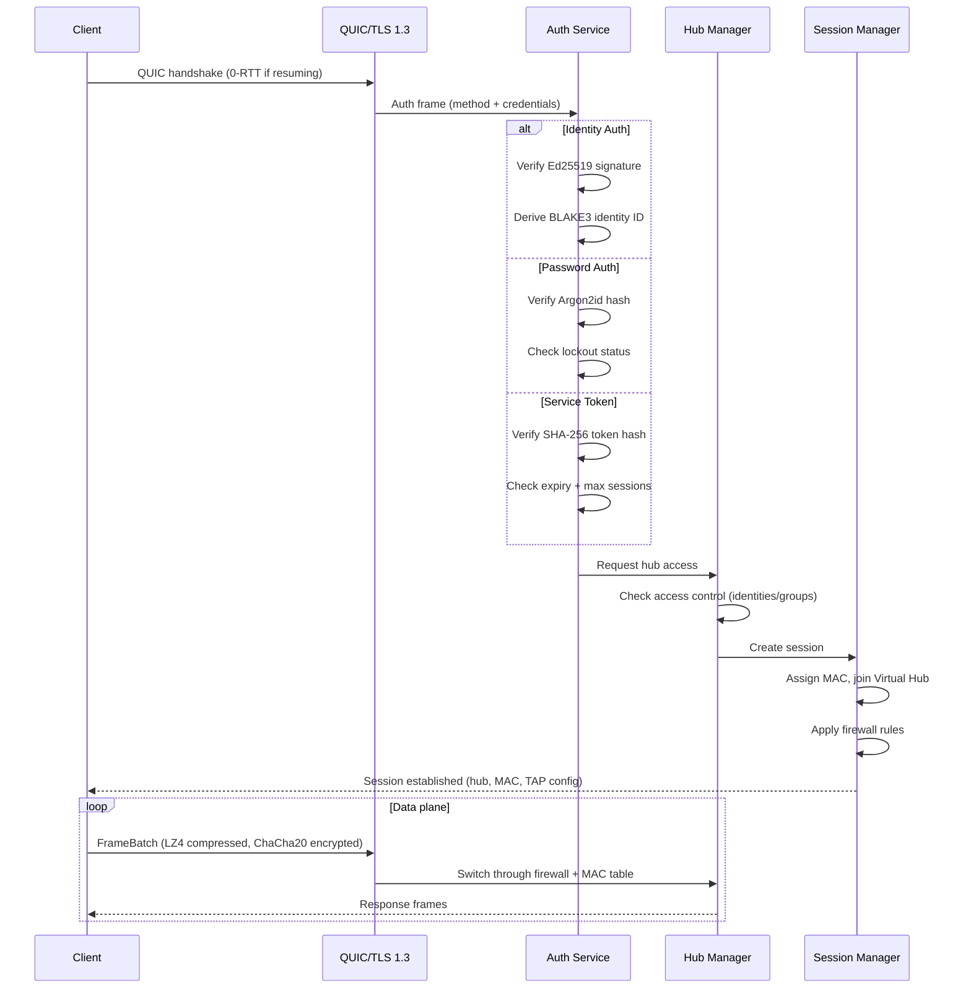
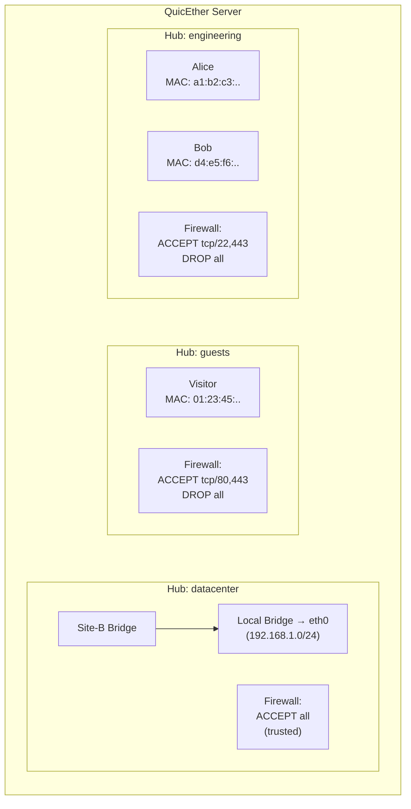
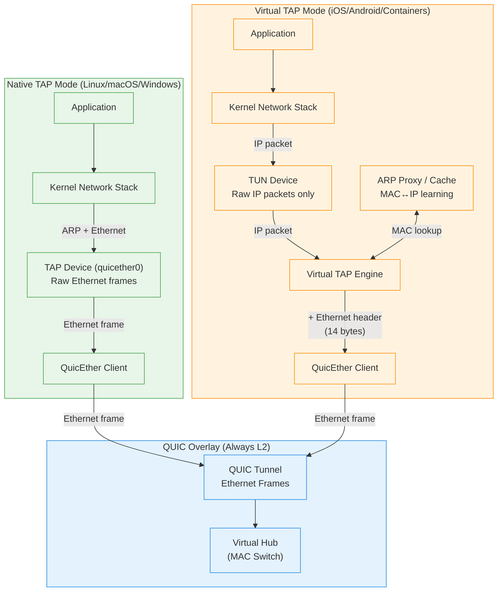

# QuicEther Architecture Diagrams

> **Post-httpf Revision:** These diagrams reflect the validated hub-based,
> server mesh architecture ported from HTTP Fabric to native QUIC,
> using Layer 2 (TAP/Ethernet) switching inspired by SoftEther.

## Diagram 1: System Architecture

## Diagram 2: Server Mesh Topology

## Diagram 3: Authentication & Session Flow

## Diagram 4: Hub Multi-Tenancy

## Diagram 5: Device Abstraction Layer (Native TAP vs Virtual TAP)

