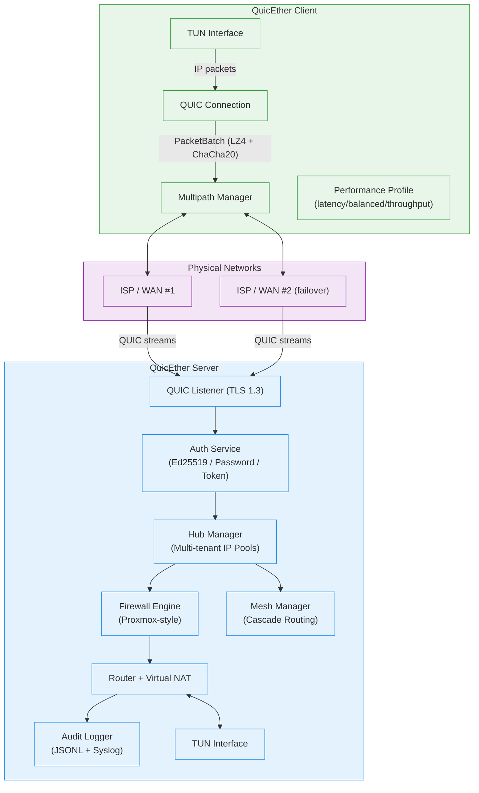
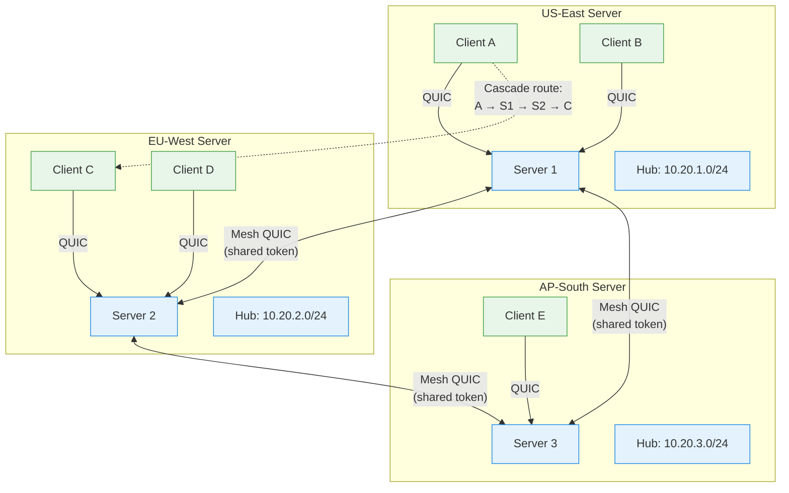
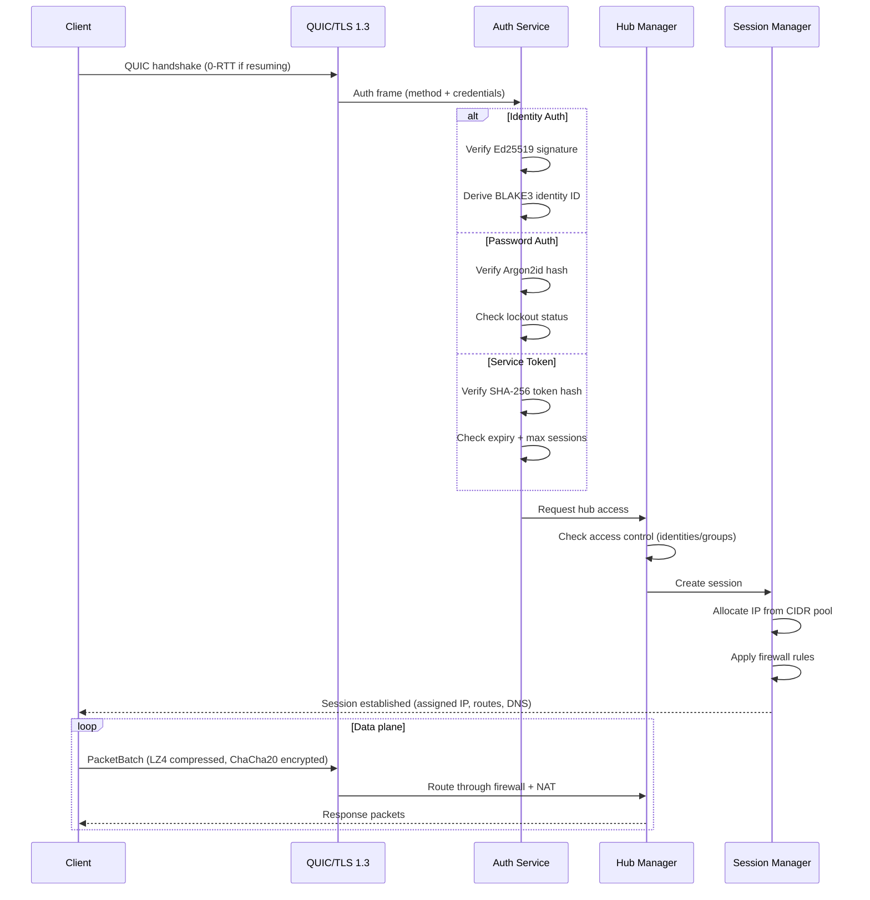
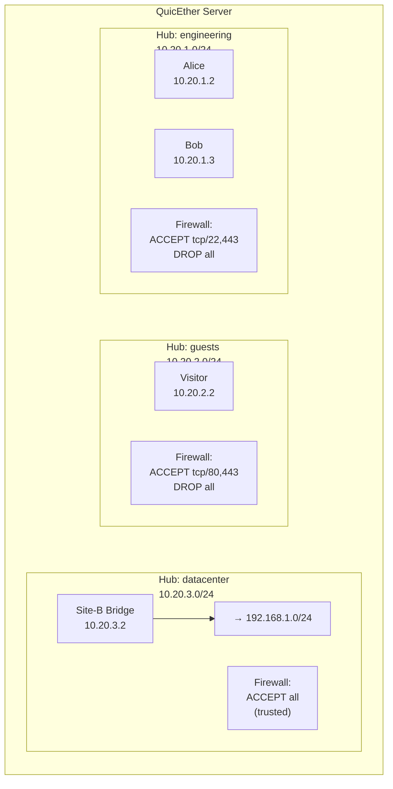

# QuicEther Architecture Diagrams

> **Post-httpf Revision:** These diagrams reflect the validated hub-based,
> server mesh architecture ported from HTTP Fabric to native QUIC.

## Diagram 1: System Architecture

## Diagram 2: Server Mesh Topology

## Diagram 3: Authentication & Session Flow

## Diagram 4: Hub Multi-Tenancy

